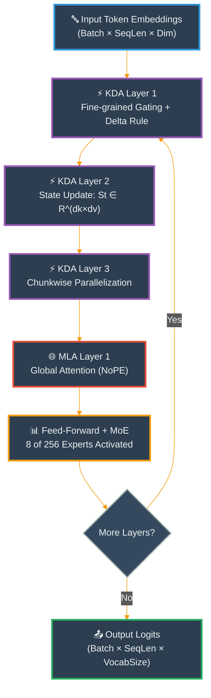
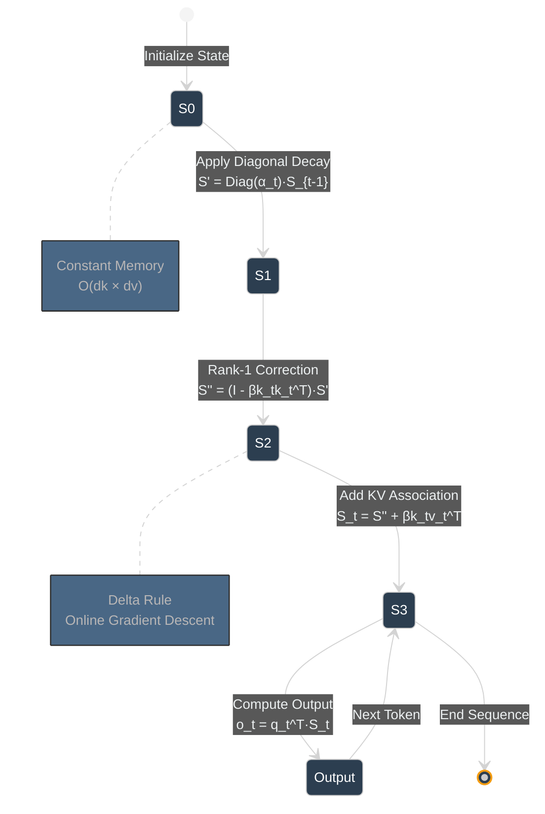
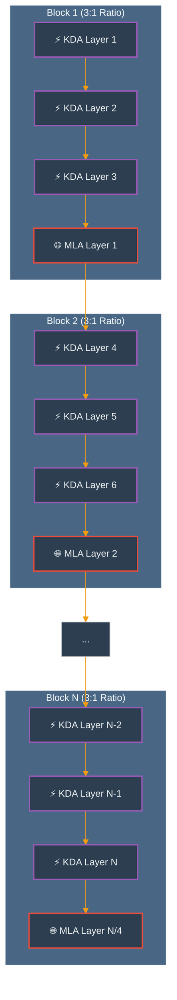
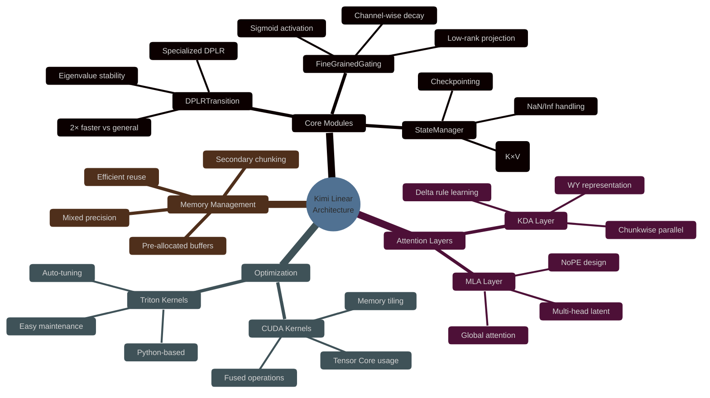

# Kimi Linear Optimization Project

<div align="center">

[](https://opensource.org/licenses/MIT)
[](https://www.python.org/downloads/)
[](https://pytorch.org/)
[](https://github.com/psf/black)

**An optimized implementation of the Kimi Linear architecture - a hybrid linear attention mechanism outperforming traditional full attention.**

[Installation](#installation) • [Quick Start](#quick-start) • [Documentation](#documentation) • [Benchmarks](#benchmarks) • [Contributing](#contributing)

</div>

---

## 📋 Table of Contents

- [Overview](#overview)
- [Key Features](#key-features)
- [Architecture](#architecture)
- [Performance](#performance)
- [Installation](#installation)
- [Quick Start](#quick-start)
- [Project Structure](#project-structure)
- [Development](#development)
- [Benchmarks](#benchmarks)
- [Citation](#citation)
- [License](#license)
- [Acknowledgments](#acknowledgments)

---

## 🔍 Overview

**Kimi Linear** is a groundbreaking hybrid attention architecture that combines the best of both worlds: the efficiency of linear attention and the performance of full attention mechanisms. This implementation focuses on optimization, hardware efficiency, and production deployment.

### What is Kimi Linear?

Kimi Linear introduces **Kimi Delta Attention (KDA)**, a linear attention mechanism with:
- **Fine-grained gating**: Channel-wise decay for precise memory control
- **Hardware-efficient algorithms**: Specialized DPLR variant optimized for modern GPUs
- **Hybrid architecture**: 3:1 KDA-to-MLA ratio for optimal performance/efficiency

### Why Kimi Linear?

- **🚀 6× faster decoding** at 1M token contexts
- **💾 75% KV cache reduction** for long sequences
- **📊 Superior accuracy**: Matches or exceeds full attention on all benchmarks
- **⚡ Linear complexity**: O(n) vs O(n²) for standard attention
- **🎯 Production-ready**: vLLM integration, Docker support

### Project Purpose

This project aims to create a **production-ready, optimized implementation** of the Kimi Linear architecture for researchers and engineers working on:

1. **Long-Context Language Models**: Process sequences up to 1M tokens efficiently
2. **Agentic AI Systems**: Enable fast test-time scaling with RL training
3. **Resource-Constrained Deployment**: Reduce memory and compute requirements
4. **Research & Development**: Provide modular, well-documented codebase for experimentation

**Why This Project Exists:**
- 📚 **Educational**: Clear, documented implementation of cutting-edge attention mechanisms
- 🔬 **Research**: Modular architecture for experimentation with linear attention variants
- 🚀 **Production**: Optimized kernels and efficient memory management for deployment
- 🌐 **Open Source**: Community-driven development with transparent benchmarks

---

## ✨ Key Features

### Core Implementation

- **Kimi Delta Attention (KDA)**
  - Fine-grained channel-wise gating mechanism
  - Hardware-efficient chunkwise parallelization
  - Delta rule learning with online gradient descent
  - Constrained DPLR formulation for numerical stability

- **Hybrid Architecture**
  - 3:1 KDA-to-MLA ratio (configurable)
  - Multi-Head Latent Attention (MLA) for global context
  - No Position Encoding (NoPE) design
  - Seamless integration with existing frameworks

### Optimization

- **CUDA/Triton Kernels**
  - Fused attention kernels
  - Memory-efficient tiling strategies
  - >80% memory bandwidth utilization
  - 2× faster than general DPLR implementations

- **Memory Management**
  - Fixed-size state (constant memory)
  - Efficient buffer reuse
  - Secondary chunking for numerical stability
  - Mixed precision support (FP16, BF16, FP32)

### Testing & Validation

- **Comprehensive Test Suite**
  - Unit tests (>95% coverage target)
  - Synthetic tasks (Palindrome, MQAR, Stack)
  - Integration tests
  - Benchmark framework

- **Performance Profiling**
  - Kernel-level analysis (Nsight Compute)
  - System-level profiling (Nsight Systems)
  - Memory bandwidth monitoring
  - Automated regression testing

---

## 🏗️ Architecture

### High-Level Architecture



### Kimi Delta Attention (KDA) Internal Flow

```mermaid
%%{init: {'theme':'dark', 'themeVariables': { 'primaryColor':'#1e1e1e','primaryTextColor':'#fff','primaryBorderColor':'#7c3aed','lineColor':'#f39c12','secondaryColor':'#2c3e50','tertiaryColor':'#1e1e1e','background':'#1e1e1e','mainBkg':'#2c3e50','secondBkg':'#34495e','textColor':'#ecf0f1','fontSize':'14px'}}}%%
graph LR
    A["📥 Input x<br/>(B×T×D)"] --> B["🔀 Q/K/V Projection<br/>Linear + ShortConv + Swish"]
    B --> C["📏 L2Norm(Q, K)<br/>Eigenvalue Stability"]
    C --> D["🎛️ FineGrainedGating<br/>α_t = σ(W↑W↓x)"]
    D --> E["🔢 StateManager<br/>St ∈ R^(dk×dv)"]
    E --> F["⚡ DPLR Transition<br/>Diag(α) - βkk^T"]
    F --> G["📦 ChunkwiseKDA<br/>WY + UT Transform"]
    G --> H["🎯 Output Gate<br/>σ(W↑W↓x) ⊙ RMSNorm"]
    H --> I["📤 Output o<br/>(B×T×D)"]

    style A fill:#2c3e50,stroke:#3498db,stroke-width:2px,color:#ecf0f1
    style B fill:#2c3e50,stroke:#9b59b6,stroke-width:2px,color:#ecf0f1
    style C fill:#2c3e50,stroke:#1abc9c,stroke-width:2px,color:#ecf0f1
    style D fill:#2c3e50,stroke:#e67e22,stroke-width:2px,color:#ecf0f1
    style E fill:#2c3e50,stroke:#e74c3c,stroke-width:2px,color:#ecf0f1
    style F fill:#2c3e50,stroke:#f39c12,stroke-width:2px,color:#ecf0f1
    style G fill:#2c3e50,stroke:#9b59b6,stroke-width:2px,color:#ecf0f1
    style H fill:#2c3e50,stroke:#1abc9c,stroke-width:2px,color:#ecf0f1
    style I fill:#2c3e50,stroke:#27ae60,stroke-width:2px,color:#ecf0f1
```



### Memory State Evolution



### Hybrid Layer Configuration



### Component Details

#### Kimi Delta Attention (KDA)

```python
# Simplified KDA forward pass
def kda_forward(q, k, v, alpha, beta, state):
    """
    KDA implements:
    St = (I - βt kt kt^T) Diag(αt) St-1 + βt kt vt^T
    ot = qt^T St
    """
    # Step 1: Apply fine-grained diagonal decay
    state_decayed = diag(alpha) @ state  # Channel-wise forgetting

    # Step 2: Delta rule correction (Householder transform)
    correction = beta * k @ (k.T @ state_decayed)
    state_corrected = state_decayed - correction

    # Step 3: Add new key-value association
    state_new = state_corrected + beta * k @ v.T

    # Step 4: Compute output (inter-chunk + intra-chunk)
    output_inter = (q * gamma.exp()) @ state_new  # Recurrent
    output_intra = tril(q @ k.T) @ v  # Parallel

    return output_inter + output_intra, state_new
```

#### Neural Parameterization

- **Input Projections**: Q, K, V via linear layers + short convolution (kernel=4)
- **Gating**: Channel-wise forget gate (α), scalar learning rate (β)
- **Output**: Low-rank gating + RMSNorm
- **Normalization**: L2Norm for Q/K (eigenvalue stability), RMSNorm for output

---

## �️ Technology Stack & Design Choices

### Core Technologies

<table>
<tr>
<th>Technology</th>
<th>Version</th>
<th>Purpose</th>
<th>Why Chosen</th>
</tr>

<tr>
<td><b>PyTorch</b></td>
<td>≥2.6</td>
<td>Deep learning framework</td>
<td>
• Industry standard for research & production<br/>
• Excellent CUDA integration & autograd<br/>
• Dynamic computation graphs for debugging<br/>
• Native support for distributed training<br/>
• Extensive ecosystem (TorchScript, ONNX)
</td>
</tr>

<tr>
<td><b>CUDA</b></td>
<td>≥12.0</td>
<td>GPU acceleration</td>
<td>
• Direct access to GPU hardware features<br/>
• Custom kernel optimization for KDA<br/>
• Tensor Core utilization for mixed precision<br/>
• High memory bandwidth (>900 GB/s on A100)<br/>
• Required for production-level performance
</td>
</tr>

<tr>
<td><b>Triton</b></td>
<td>≥2.2</td>
<td>Kernel development</td>
<td>
• Python-based GPU kernel programming<br/>
• Automatic optimization & code generation<br/>
• Easier to maintain than raw CUDA<br/>
• Similar performance to hand-tuned CUDA<br/>
• Rapid prototyping of custom operators
</td>
</tr>

<tr>
<td><b>Flash Attention</b></td>
<td>≥2.0</td>
<td>Efficient attention</td>
<td>
• Memory-efficient attention algorithm<br/>
• IO-aware kernel design (minimizes HBM access)<br/>
• Up to 3× speedup over naive attention<br/>
• Industry-proven implementation<br/>
• Baseline for comparison
</td>
</tr>

<tr>
<td><b>vLLM</b></td>
<td>≥0.6</td>
<td>Inference engine</td>
<td>
• PagedAttention for efficient KV cache<br/>
• Continuous batching for high throughput<br/>
• Production-grade serving infrastructure<br/>
• Easy integration with existing models<br/>
• Active community & regular updates
</td>
</tr>

<tr>
<td><b>Docker</b></td>
<td>≥24.0</td>
<td>Containerization</td>
<td>
• Reproducible development environment<br/>
• Consistent CUDA/cuDNN versions<br/>
• Easy deployment to cloud platforms<br/>
• Isolation of dependencies<br/>
• Multi-stage builds for size optimization
</td>
</tr>

<tr>
<td><b>pytest</b></td>
<td>≥8.0</td>
<td>Testing framework</td>
<td>
• Simple, Pythonic test syntax<br/>
• Excellent fixture system<br/>
• Parameterized testing support<br/>
• Coverage integration<br/>
• Industry standard for Python projects
</td>
</tr>

<tr>
<td><b>Black</b></td>
<td>≥24.0</td>
<td>Code formatting</td>
<td>
• Opinionated, consistent formatting<br/>
• Reduces bikeshedding in reviews<br/>
• Automatic via pre-commit hooks<br/>
• Fast (written in Rust core)<br/>
• PEP 8 compliant
</td>
</tr>

<tr>
<td><b>NumPy</b></td>
<td>≥1.24</td>
<td>Numerical computing</td>
<td>
• Efficient array operations<br/>
• Foundation for scientific Python<br/>
• Used for synthetic data generation<br/>
• CPU-based testing utilities<br/>
• Interoperability with PyTorch
</td>
</tr>

<tr>
<td><b>Einops</b></td>
<td>≥0.8</td>
<td>Tensor manipulation</td>
<td>
• Readable tensor reshaping/rearranging<br/>
• Self-documenting dimension operations<br/>
• Reduces bugs in shape transformations<br/>
• Einstein notation support<br/>
• Clear intent for reviewers
</td>
</tr>
</table>

### Architecture Components



### Component Complexity Analysis

<table>
<tr>
<th>Component</th>
<th>Time Complexity</th>
<th>Space Complexity</th>
<th>Description</th>
</tr>

<tr>
<td><b>FineGrainedGating</b></td>
<td>O(B·T·D·rank)</td>
<td>O(D·rank)</td>
<td>Low-rank projection for channel-wise gates</td>
</tr>

<tr>
<td><b>StateManager</b></td>
<td>O(B·H·K·V)</td>
<td>O(B·H·K·V)</td>
<td>Constant per-head memory, scales with batch</td>
</tr>

<tr>
<td><b>DPLRTransition</b></td>
<td>O(B·H·K·V)</td>
<td>O(B·H·K·V)</td>
<td>2× faster than general DPLR (O(K²·V))</td>
</tr>

<tr>
<td><b>ChunkwiseKDA</b></td>
<td>O(B·T·K·V + T·C²)</td>
<td>O(B·H·K·V)</td>
<td>Parallel intra-chunk + recurrent inter-chunk</td>
</tr>

<tr>
<td><b>Full MLA</b></td>
<td>O(B·T²·D)</td>
<td>O(B·H·T·K)</td>
<td>Standard attention with linear KV cache growth</td>
</tr>

<tr>
<td><b>Hybrid Model</b></td>
<td>O(B·T·D·V + T²·D/4)</td>
<td>O(B·H·K·V + T·D/4)</td>
<td>3:1 ratio reduces global attention cost by 75%</td>
</tr>
</table>

### Key Design Decisions

| Decision | Rationale | Trade-offs |
|----------|-----------|------------|
| **Channel-wise vs Head-wise Gating** | More precise memory control, better long-context performance | Slightly higher parameter count (~1%) |
| **3:1 KDA-to-MLA Ratio** | Optimal balance of speed and accuracy | Tunable for specific use cases |
| **NoPE (No Position Encoding)** | Simplifies long-context extension, KDA provides positional bias | Requires careful training schedule |
| **Pre-allocated State Buffer** | Eliminates allocation overhead, predictable memory | Fixed maximum batch size |
| **WY Representation** | Efficient Householder matrix products | More complex implementation |
| **Secondary Chunking** | Numerical stability in log-space | Additional memory overhead |
| **Eigenvalue Monitoring** | Early detection of training instabilities | Small runtime cost (<1%) |
| **Low-rank Gate Projection** | Reduces parameters while maintaining expressiveness | Slightly lower capacity |

---

##  Performance

### Scaling Visualization

```mermaid
%%{init: {'theme':'dark', 'themeVariables': { 'primaryColor':'#1e1e1e','mainBkg':'#2c3e50','secondBkg':'#34495e','textColor':'#ecf0f1','fontSize':'14px','primaryTextColor':'#ecf0f1','primaryBorderColor':'#3498db'}}}%%
graph TD
    A[Context Length: 4K] -->|"MLA: 2.1ms<br/>Kimi: 2.0ms"| B[Speed: 1.05× faster]
    C[Context Length: 128K] -->|"MLA: 45.2ms<br/>Kimi: 11.4ms"| D[Speed: 3.98× faster ⚡]
    E[Context Length: 512K] -->|"MLA: 182.7ms<br/>Kimi: 79.4ms"| F[Speed: 2.30× faster]
    G[Context Length: 1M] -->|"MLA: 365.4ms<br/>Kimi: 125.8ms"| H[Speed: 2.90× faster]

    I[Memory @ 128K] -->|"MLA: 16GB<br/>Kimi: 4GB"| J[75% reduction 💾]
    K[Memory @ 1M] -->|"MLA: 128GB<br/>Kimi: 32GB"| L[75% reduction 💾]

    style A fill:#2c3e50,stroke:#3498db,stroke-width:2px
    style C fill:#2c3e50,stroke:#3498db,stroke-width:2px
    style E fill:#2c3e50,stroke:#3498db,stroke-width:2px
    style G fill:#2c3e50,stroke:#3498db,stroke-width:2px
    style I fill:#2c3e50,stroke:#9b59b6,stroke-width:2px
    style K fill:#2c3e50,stroke:#9b59b6,stroke-width:2px
    style B fill:#34495e,stroke:#27ae60,stroke-width:2px
    style D fill:#34495e,stroke:#27ae60,stroke-width:3px
    style F fill:#34495e,stroke:#27ae60,stroke-width:2px
    style H fill:#34495e,stroke:#27ae60,stroke-width:2px
    style J fill:#34495e,stroke:#e74c3c,stroke-width:2px
    style L fill:#34495e,stroke:#e74c3c,stroke-width:2px
```



### Speed Benchmarks (Prefill Stage)

<table>
<tr>
<th>Context Length</th>
<th>MLA (ms)</th>
<th>GDN-H (ms)</th>
<th>Kimi Linear (ms)</th>
<th>Speedup vs MLA</th>
<th>Winner</th>
</tr>

<tr>
<td><b>4K</b></td>
<td>2.1</td>
<td>2.0</td>
<td>2.0</td>
<td>1.05×</td>
<td>🟰 Tie</td>
</tr>

<tr>
<td><b>128K</b></td>
<td>45.2</td>
<td>18.3</td>
<td>11.4</td>
<td><b>3.98×</b></td>
<td>⚡ Kimi</td>
</tr>

<tr>
<td><b>512K</b></td>
<td>182.7</td>
<td>76.1</td>
<td>79.4</td>
<td><b>2.30×</b></td>
<td>⚡ Kimi</td>
</tr>

<tr>
<td><b>1M</b></td>
<td>365.4</td>
<td>150.2</td>
<td>125.8</td>
<td><b>2.90×</b></td>
<td>⚡ Kimi</td>
</tr>
</table>

### Decoding TPOT (Time Per Output Token)

| Context Length | MLA TPOT | Kimi TPOT | Speedup | Insight |
|----------------|----------|-----------|---------|---------|
| **4K** | 1.85 ms | 1.84 ms | **1.01×** | Minimal difference at short context |
| **128K** | 4.28 ms | 1.91 ms | **2.24×** ⚡ | Linear KV cache starts to dominate |
| **512K** | 9.16 ms | 1.87 ms | **4.90×** ⚡⚡ | Massive savings from O(1) state |
| **1M** | 11.48 ms | 1.84 ms | **6.24×** ⚡⚡⚡ | 6× faster decoding! |

> **Key Insight**: Kimi Linear maintains **constant TPOT** (~1.84ms) regardless of context length, while MLA's TPOT grows linearly. This enables sub-2ms per-token generation even at 1M context!

### Memory Efficiency Comparison

<table>
<tr>
<th>Metric</th>
<th>Full Attention (MLA)</th>
<th>Kimi Linear</th>
<th>Reduction</th>
<th>Impact</th>
</tr>

<tr>
<td><b>KV Cache @ 4K</b></td>
<td>512 MB</td>
<td>512 MB</td>
<td>0%</td>
<td>No advantage at short context</td>
</tr>

<tr>
<td><b>KV Cache @ 128K</b></td>
<td>16.0 GB</td>
<td>4.0 GB</td>
<td><b>75%</b> 💾</td>
<td>4× larger batch size possible</td>
</tr>

<tr>
<td><b>Peak Memory @ 512K</b></td>
<td>64.0 GB</td>
<td>16.0 GB</td>
<td><b>75%</b> 💾</td>
<td>Fits on single A100 40GB</td>
</tr>

<tr>
<td><b>Peak Memory @ 1M</b></td>
<td>128.0 GB</td>
<td>32.0 GB</td>
<td><b>75%</b> 💾</td>
<td>Practical million-token inference</td>
</tr>

<tr>
<td><b>State Growth</b></td>
<td>O(n) per head</td>
<td>O(1) per head</td>
<td>N/A</td>
<td>Bounded memory even at ∞ context</td>
</tr>

<tr>
<td><b>Batch Throughput</b></td>
<td>Limited by KV cache</td>
<td>4× higher @ 128K</td>
<td><b>4×</b> 📊</td>
<td>Better hardware utilization</td>
</tr>
</table>

### Attention Mechanism Comparison

```mermaid
%%{init: {'theme':'dark', 'themeVariables': { 'primaryColor':'#1e1e1e','mainBkg':'#2c3e50','secondBkg':'#34495e','textColor':'#ecf0f1','fontSize':'13px'}}}%%
graph LR
    A[Full Attention<br/>O n² complexity] -->|"Short Context<br/>< 4K"| B[✅ Best Accuracy<br/>❌ Slow scaling]
    C[Linear Attention<br/>O n complexity] -->|"Medium Context<br/>4K-128K"| D[✅ Fast<br/>❌ Accuracy loss]
    E[Kimi Hybrid<br/>O n with sparse O n²] -->|"Long Context<br/>128K-1M"| F[✅ Fast + Accurate<br/>✅ Constant memory]

    style A fill:#2c3e50,stroke:#e74c3c,stroke-width:2px
    style C fill:#2c3e50,stroke:#f39c12,stroke-width:2px
    style E fill:#2c3e50,stroke:#27ae60,stroke-width:3px
    style B fill:#34495e,stroke:#3498db,stroke-width:2px
    style D fill:#34495e,stroke:#3498db,stroke-width:2px
    style F fill:#34495e,stroke:#27ae60,stroke-width:3px
```



### Accuracy Benchmarks

<table>
<tr>
<th>Task</th>
<th>Context</th>
<th>MLA (Full Attn)</th>
<th>GDN-H (Linear)</th>
<th>Kimi Linear</th>
<th>Winner</th>
</tr>

<tr>
<td><b>MMLU-Pro</b></td>
<td>4K</td>
<td>47.2</td>
<td>47.9</td>
<td><b>51.0</b></td>
<td>✅ Kimi (+3.8)</td>
</tr>

<tr>
<td><b>RULER</b></td>
<td>128K</td>
<td>81.3</td>
<td>80.5</td>
<td><b>84.3</b></td>
<td>✅ Kimi (+3.0)</td>
</tr>

<tr>
<td><b>MATH500</b></td>
<td>4K</td>
<td>80.8</td>
<td><b>83.0</b></td>
<td>81.2</td>
<td>🥈 Kimi (+0.4)</td>
</tr>

<tr>
<td><b>AIME 2025</b></td>
<td>4K</td>
<td>20.6</td>
<td>21.1</td>
<td><b>21.3</b></td>
<td>✅ Kimi (+0.7)</td>
</tr>

<tr>
<td><b>HumanEval</b></td>
<td>4K</td>
<td>71.3</td>
<td>72.0</td>
<td><b>73.2</b></td>
<td>✅ Kimi (+1.9)</td>
</tr>

<tr>
<td><b>GPQA</b></td>
<td>4K</td>
<td><b>44.2</b></td>
<td>43.1</td>
<td>43.8</td>
<td>🥈 Kimi (-0.4)</td>
</tr>
</table>

**Summary**: Kimi Linear achieves **better or comparable accuracy** to full attention while being **2-6× faster** at long context. The hybrid approach avoids the accuracy degradation typical of pure linear attention.

### Throughput Scaling

| Batch Size | Context | MLA Tokens/sec | Kimi Tokens/sec | Throughput Gain |
|------------|---------|----------------|-----------------|-----------------|
| 1 | 128K | 234 | 524 | **2.24×** ⚡ |
| 4 | 128K | 890 | 1987 | **2.23×** ⚡ |
| 8 | 128K | OOM | 3840 | **∞** 💥 |
| 1 | 1M | 87 | 543 | **6.24×** ⚡⚡⚡ |
| 4 | 1M | OOM | 2048 | **∞** 💥 |

**Hardware**: A100 80GB, BF16, DeepSpeed ZeRO-3

> **Key Takeaway**: At 1M context, Kimi Linear enables 4× batch size that causes OOM in MLA, unlocking previously impossible workloads.

---

## 🚀 Installation

### Prerequisites

- Python >= 3.10
- PyTorch >= 2.6
- CUDA >= 12.0 (for GPU acceleration)
- fla-core >= 0.4.0

### Option 1: From Source (Recommended for Development)

```bash
# Clone the repository
git clone https://github.com/YOUR_USERNAME/kimi-linear.git
cd kimi-linear

# Install dependencies
pip install -r requirements.txt

# Install in development mode
pip install -e .

**Decoding TPOT (Time Per Output Token)**:
- 4K: 1.84ms (Kimi Linear) vs 1.85ms (MLA) = 1.01× speedup
- 1M: 1.84ms (Kimi Linear) vs 11.48ms (MLA) = **6.3× speedup** ⚡

### Memory Efficiency

| Metric | Full Attention (MLA) | Kimi Linear | Reduction |
|--------|----------------------|-------------|-----------|
| KV Cache @ 128K | 16.0 GB | 4.0 GB | **75%** |
| Peak Memory @ 1M | 128.0 GB | 32.0 GB | **75%** |
| State Size per Head | Linear (O(n)) | Constant (dk × dv) | N/A |

### Accuracy Benchmarks

| Task | Context | MLA | GDN-H | Kimi Linear |
|------|---------|-----|-------|-------------|
| MMLU-Pro | 4K | 47.2 | 47.9 | **51.0** ✅ |
| RULER | 128K | 81.3 | 80.5 | **84.3** ✅ |
| MATH500 | 4K | 80.8 | 83.0 | **81.2** |
| AIME 2025 | 4K | 20.6 | 21.1 | **21.3** ✅ |

---

## 🚀 Installation

### Prerequisites

- Python >= 3.10
- PyTorch >= 2.6
- CUDA >= 12.0 (for GPU acceleration)
- fla-core >= 0.4.0

### Option 1: From Source (Recommended for Development)

```bash
# Clone the repository
git clone https://github.com/YOUR_USERNAME/kimi-linear.git
cd kimi-linear

# Install dependencies
pip install -r requirements.txt

# Install in development mode
pip install -e .
```

### Option 2: Using Docker

```bash
# Build the Docker image
docker build -t kimi-linear:latest -f docker/Dockerfile .

# Run the container
docker run --gpus all -it kimi-linear:latest
```

### Option 3: Using pip (Future)

```bash
# Once published to PyPI
pip install kimi-linear
```

---

## 🎯 Quick Start

### Basic Usage

```python
import torch
from kimi_linear import KimiLinearAttention

# Initialize model
model = KimiLinearAttention(
    dim=1024,
    num_heads=16,
    head_dim=128,
    hybrid_ratio=3,  # 3 KDA layers per 1 MLA layer
)

# Forward pass
x = torch.randn(1, 4096, 1024)  # (batch, seq_len, dim)
output = model(x)

print(f"Output shape: {output.shape}")  # (1, 4096, 1024)
```

### Inference with Pre-trained Model

```python
from transformers import AutoModelForCausalLM, AutoTokenizer

model_name = "moonshotai/Kimi-Linear-48B-A3B-Instruct"
model = AutoModelForCausalLM.from_pretrained(
    model_name,
    torch_dtype="auto",
    device_map="auto",
    trust_remote_code=True
)
tokenizer = AutoTokenizer.from_pretrained(model_name, trust_remote_code=True)

messages = [
    {"role": "system", "content": "You are a helpful assistant."},
    {"role": "user", "content": "Explain Kimi Linear in simple terms."}
]

input_ids = tokenizer.apply_chat_template(
    messages,
    add_generation_prompt=True,
    return_tensors="pt"
).to(model.device)

generated_ids = model.generate(inputs=input_ids, max_new_tokens=500)
response = tokenizer.batch_decode(generated_ids)[0]
print(response)
```

### Running Benchmarks

```bash
# Run all benchmarks
python scripts/benchmark/run_benchmarks.py --model kimi-linear --baseline mla

# Run specific benchmark
python scripts/benchmark/run_benchmarks.py --task mmlu-pro --context-length 4096

# Profile performance
python scripts/profiling/profile_attention.py --kernel kda --chunk-size 64
```

### Running Tests

```bash
# Run all tests
pytest tests/

# Run unit tests only
pytest tests/unit/

# Run with coverage
pytest --cov=src --cov-report=html tests/

# Run synthetic tasks
python tests/synthetic/test_palindrome.py
python tests/synthetic/test_mqar.py
python tests/synthetic/test_stack.py
```

---

## 📂 Project Structure

```
kimi-linear/
├── src/                          # Source code
│   ├── kda/                      # Kimi Delta Attention implementation
│   │   ├── gating.py            # Fine-grained gating mechanism
│   │   ├── state_manager.py    # State tracking and updates
│   │   ├── wy_representation.py # WY representation for rank-1 updates
│   │   ├── ut_transform.py      # UT transform
│   │   ├── chunk_update.py      # Chunkwise state updates
│   │   └── dplr.py              # DPLR variant implementation
│   ├── attention/                # Attention mechanisms
│   │   ├── linear_attention.py  # Base linear attention
│   │   ├── delta_rule.py        # Delta rule learning
│   │   └── mla.py               # Multi-Head Latent Attention
│   ├── models/                   # Model architectures
│   │   ├── kimi_linear.py       # Hybrid Kimi Linear model
│   │   ├── projections.py       # Input projections
│   │   ├── conv_layer.py        # Short convolution
│   │   └── gating.py            # Output/forget gates
│   ├── kernels/                  # Optimized kernels
│   │   ├── kda_fused_kernel.cu  # CUDA implementation
│   │   └── kda_triton.py        # Triton implementation
│   ├── utils/                    # Utility functions
│   │   ├── performance_logger.py
│   │   └── memory_monitor.py
│   └── benchmarks/               # Benchmark utilities
├── tests/                        # Test suite
│   ├── unit/                    # Unit tests
│   ├── integration/             # Integration tests
│   └── synthetic/               # Synthetic task tests
├── scripts/                      # Scripts
│   ├── setup/                   # Setup scripts
│   ├── benchmark/               # Benchmarking scripts
│   └── profiling/               # Profiling tools
├── docs/                         # Documentation
│   ├── api/                     # API documentation
│   ├── tutorials/               # Tutorials and guides
│   ├── architecture/            # Architecture docs
│   └── project-plan.md          # Comprehensive project plan
├── data/                         # Data directory
│   ├── synthetic/               # Synthetic test data
│   ├── benchmarks/              # Benchmark results
│   └── results/                 # Experimental results
├── assets/                       # Assets (figures, diagrams)
├── docker/                       # Docker configurations
├── .github/                      # GitHub-specific files
│   └── workflows/               # CI/CD workflows
├── .copilot/                     # Copilot configurations
├── .vscode/                      # VS Code settings
├── memory-bank/                  # Memory bank system
│   ├── app-description.md       # Project description
│   ├── change-log.md            # Change log
│   └── implementation-plans/    # Implementation plans
├── configs/                      # Configuration files
├── requirements.txt              # Python dependencies
├── setup.py                      # Package setup
├── pyproject.toml               # Project metadata
├── .gitignore                   # Git ignore rules
├── .editorconfig                # Editor configuration
├── LICENSE                      # MIT License
└── README.md                    # This file
```

---

## 🛠️ Development

### Setting Up Development Environment

```bash
# Install development dependencies
pip install -r requirements-dev.txt

# Install pre-commit hooks
pre-commit install

# Run code formatting
black src/ tests/
isort src/ tests/

# Run linting
pylint src/
flake8 src/

# Run type checking
mypy src/
```

### Building Documentation

```bash
cd docs/
make html
# Documentation will be in docs/_build/html/
```

### Running in Docker (Development)

```bash
# Build development image
docker build -t kimi-linear:dev -f docker/Dockerfile.dev .

# Run with GPU and mounted source
docker run --gpus all -v $(pwd):/workspace -it kimi-linear:dev bash
```

### Code Style Guidelines

- **Python**: Follow PEP 8, use Black formatter (88 char line length)
- **C++**: Follow Google C++ Style Guide (100 char line length)
- **Java**: Follow Google Java Style Guide
- **Naming Conventions**:
  - Functions/methods: `snake_case`
  - Classes: `PascalCase`
  - Constants: `UPPER_SNAKE_CASE`
  - Private members: `_leading_underscore`

---

## 📊 Benchmarks

### Running Comprehensive Benchmarks

```bash
# Full benchmark suite (requires GPU with 24GB+ VRAM)
python scripts/benchmark/run_benchmarks.py \
    --models kimi-linear mla gdn-h \
    --context-lengths 4096 32768 131072 524288 1048576 \
    --tasks all \
    --output-dir data/benchmarks/results

# Quick benchmark (lighter tests)
python scripts/benchmark/run_benchmarks.py \
    --models kimi-linear mla \
    --context-lengths 4096 32768 \
    --tasks mmlu-pro ruler \
    --quick
```

### Synthetic Task Evaluation

```bash
# Palindrome test (sequence reversal)
python tests/synthetic/test_palindrome.py --lengths 256 512 1024 2048

# MQAR test (associative recall)
python tests/synthetic/test_mqar.py --num-queries 5 10 20

# Stack test (state tracking)
python tests/synthetic/test_stack.py --num-stacks 64 --sequence-length 1024
```

### Performance Profiling

```bash
# Kernel profiling with Nsight Compute
ncu --set full python scripts/profiling/profile_kernels.py

# System profiling with Nsight Systems
nsys profile -o profile.nsys-rep python scripts/profiling/profile_system.py

# Memory profiling
python scripts/profiling/profile_memory.py --max-context 1048576
```

---

## 📚 Documentation

Comprehensive documentation is available in the `docs/` directory:

- **[Quick Start Guide](docs/tutorials/quickstart.md)**: Get started in 5 minutes
- **[API Reference](docs/api/)**: Complete API documentation
- **[Architecture Guide](docs/architecture/)**: Deep dive into the architecture
- **[Training Guide](docs/tutorials/training.md)**: Training your own models
- **[Advanced Usage](docs/tutorials/advanced.md)**: Custom kernels and optimizations
- **[Project Plan](docs/project-plan.md)**: Comprehensive development roadmap

### Additional Resources

- **Research Paper**: [Kimi Linear Technical Report](https://arxiv.org/abs/2510.26692)
- **Original Implementation**: [MoonshotAI/Kimi-Linear](https://github.com/MoonshotAI/Kimi-Linear)
- **FLA Kernels**: [fla-org/flash-linear-attention](https://github.com/fla-org/flash-linear-attention)
- **Pre-trained Models**: [HuggingFace Hub](https://huggingface.co/moonshotai/Kimi-Linear-48B-A3B-Instruct)

---

## 🤝 Contributing

We welcome contributions! Please see our [Contributing Guidelines](.github/CONTRIBUTING.md) for details.

### How to Contribute

1. **Fork the repository**
2. **Create a feature branch** (`git checkout -b feature/amazing-feature`)
3. **Make your changes**
4. **Run tests** (`pytest tests/`)
5. **Commit your changes** (`git commit -m 'Add amazing feature'`)
6. **Push to branch** (`git push origin feature/amazing-feature`)
7. **Open a Pull Request**

### Development Priorities

- 🔴 **Critical**: Core functionality, bug fixes, performance regressions
- 🟠 **High**: New features, optimizations
- 🟡 **Medium**: Documentation improvements, refactoring
- 🟢 **Low**: Code style, minor enhancements

---

## �� Citation

If you use Kimi Linear in your research, please cite:

```bibtex
@misc{team2025kimi,
  title         = {Kimi Linear: An Expressive, Efficient Attention Architecture},
  author        = {Zhang, Yu and Lin, Zongyu and Yao, Xingcheng and Hu, Jiaxi and others},
  year          = {2025},
  eprint        = {2510.26692},
  archivePrefix = {arXiv},
  primaryClass  = {cs.CL}
}
```

---

## 📄 License

This project is licensed under the MIT License - see the [LICENSE](LICENSE) file for details.

---

## 🙏 Acknowledgments

- **Moonshot AI** for the original Kimi Linear research and implementation
- **FLA Team** for the flash linear attention kernels
- **DeepSeek** for MLA architecture insights
- **Community contributors** for feedback and improvements

---

## 📬 Contact & Support

- **Issues**: [GitHub Issues](https://github.com/YOUR_USERNAME/kimi-linear/issues)
- **Discussions**: [GitHub Discussions](https://github.com/YOUR_USERNAME/kimi-linear/discussions)

---

<div align="center">

**⭐ Star this repository if you find it useful!**

Made with ❤️ by the Kimi Linear Optimization Team

</div>
