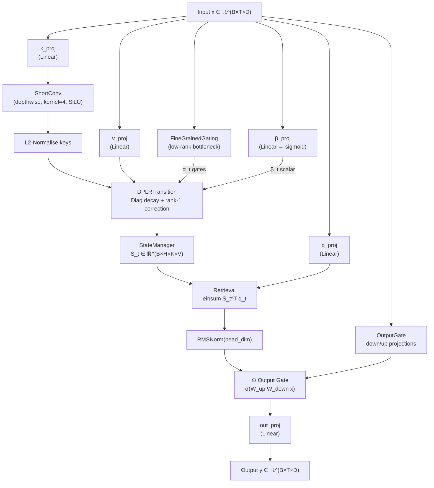
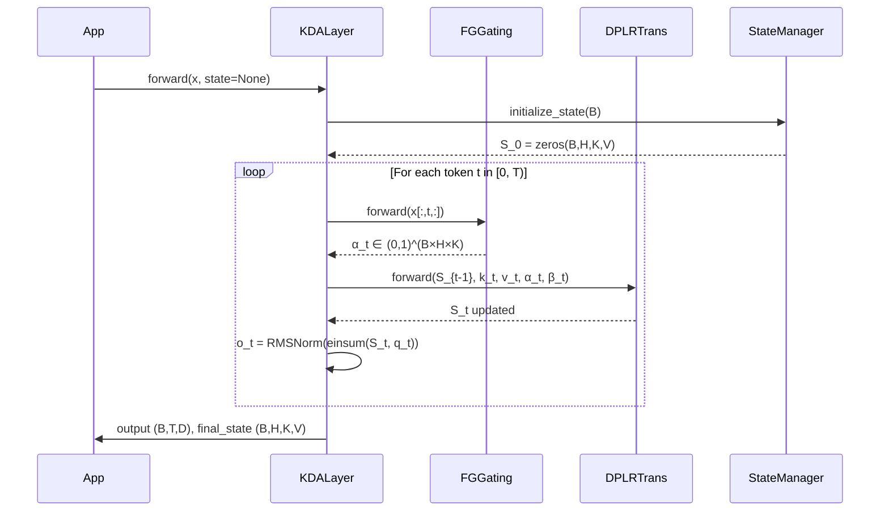
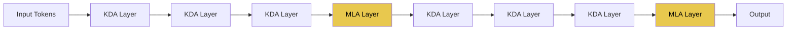
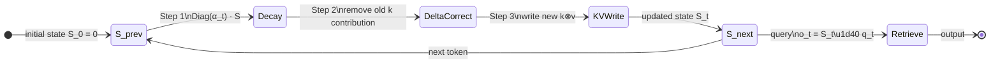
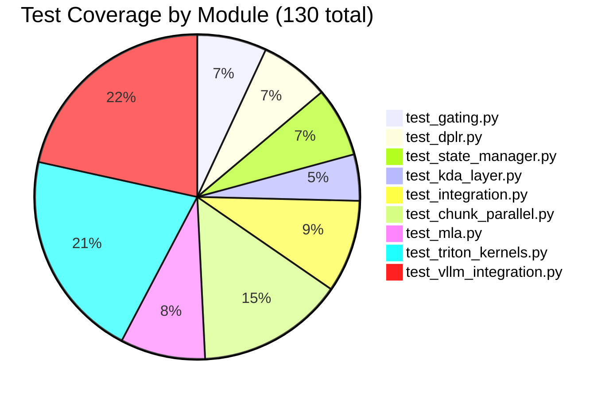
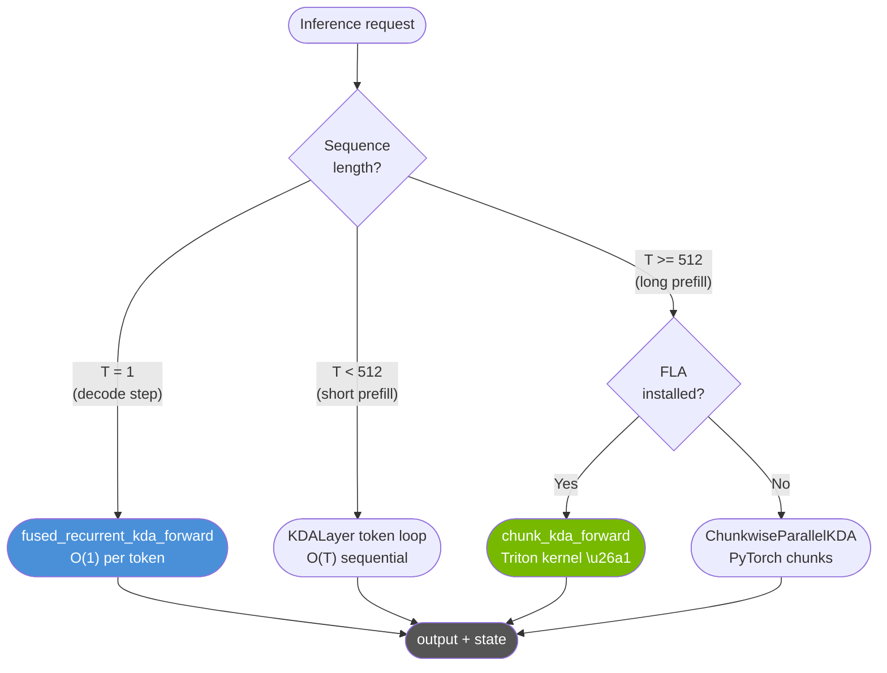
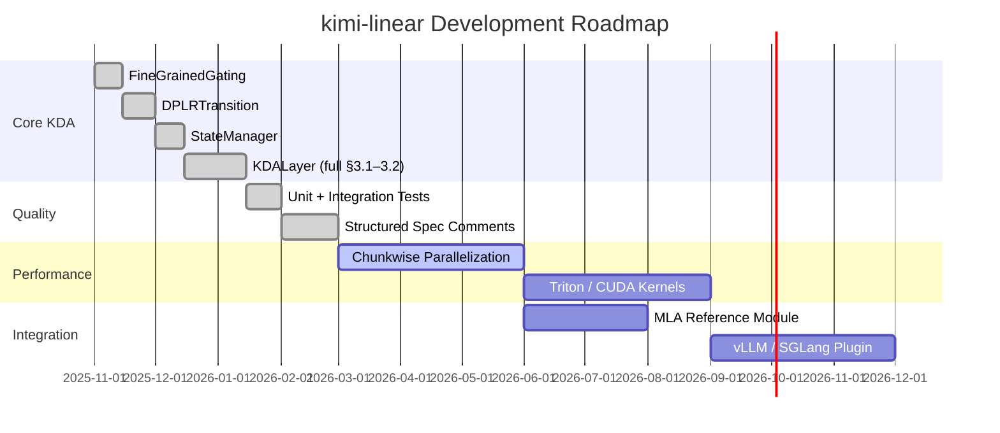
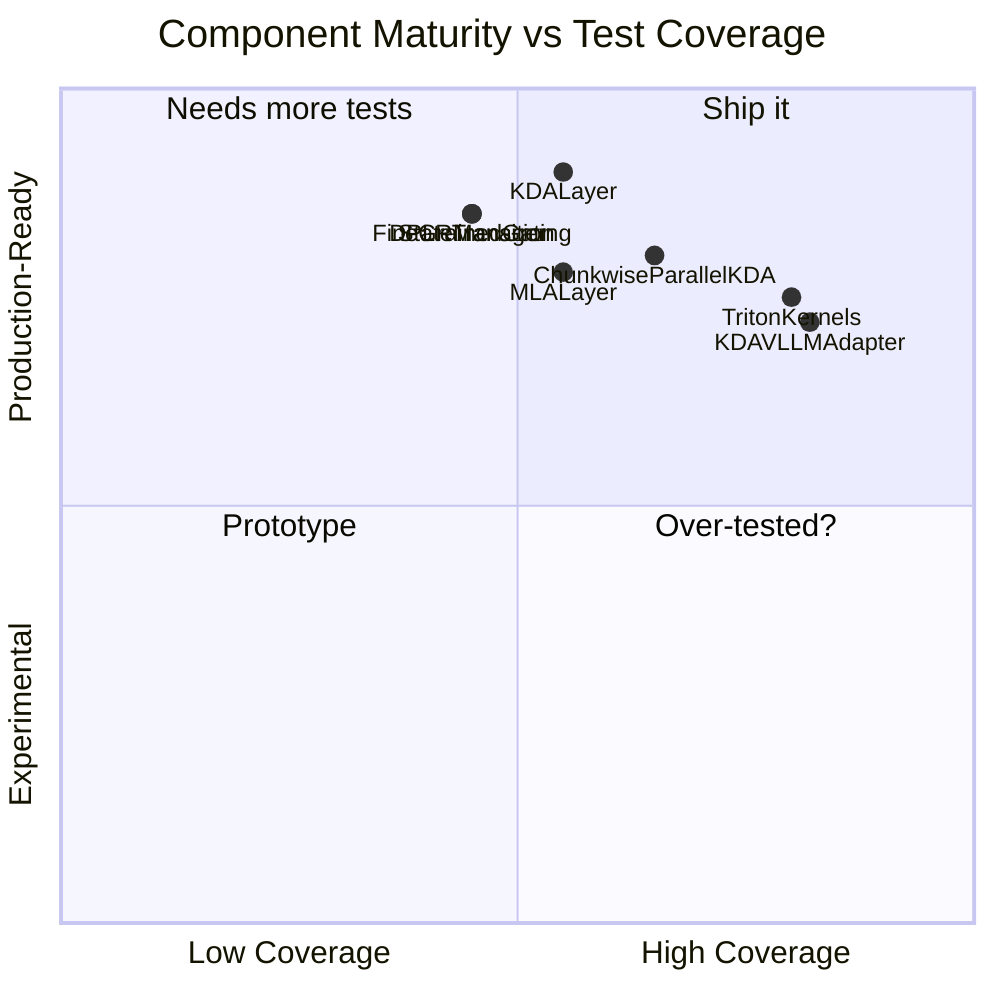
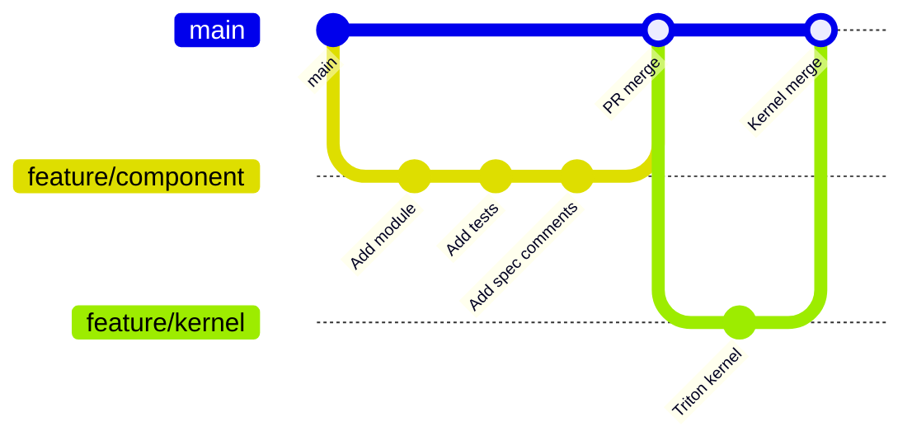
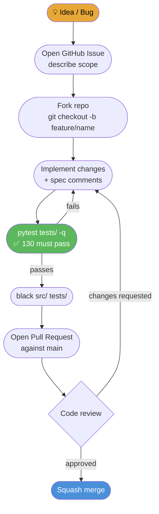

<div align="center" id="top">
  <h1>⚡ kimi-linear</h1>
  <p><em>Open-source implementation of Kimi Delta Attention — the hybrid linear-attention architecture from arXiv:2510.26692.</em></p>
</div>

<div align="center">

[](LICENSE)
[](https://github.com/hkevin01/kimi-linear/stargazers)
[](https://github.com/hkevin01/kimi-linear/network)
[](https://github.com/hkevin01/kimi-linear/commits/main)
[](https://github.com/hkevin01/kimi-linear)
[](https://github.com/hkevin01/kimi-linear/issues)
[](https://python.org)
[](https://pytorch.org)
[](https://arxiv.org/abs/2510.26692)
[](tests/)
[](https://github.com/psf/black)

</div>

---

## Table of Contents

- [Overview](#overview)
- [Key Features](#key-features)
- [Architecture](#architecture)
  - [KDA State Update](#kda-state-update)
  - [Component Diagram](#component-diagram)
  - [Sequence Flow](#sequence-flow)
- [Technology Stack](#technology-stack)
- [Setup & Installation](#setup--installation)
- [Usage](#usage)
- [Core Capabilities](#core-capabilities)
- [Benchmarks](#benchmarks)
- [Project Roadmap](#project-roadmap)
- [Implementation Status](#implementation-status)
- [Development](#development)
- [Contributing](#contributing)
- [Citation](#citation)
- [License](#license)

---

## 🔭 Overview

**kimi-linear** implements **Kimi Delta Attention (KDA)** — the linear attention module at the heart of the Kimi Linear hybrid architecture described in [`arXiv:2510.26692`](https://arxiv.org/abs/2510.26692).

KDA extends Gated DeltaNet with **channel-wise (fine-grained) forget gating**, replacing head-level scalar gates with per-channel vector gates $\alpha_t \in (0,1)^{d_k}$. This gives the finite-state RNN memory finer control over what context to retain or discard at each token step — improving long-context task performance without increasing the asymptotic O(B·H·K·V) state footprint.

The hybrid deployment stacks **three KDA layers for every one full MLA (Multi-Head Latent Attention) layer** (3:1 ratio), achieving up to **6× decoding throughput** and **75% KV-cache reduction** at 1M-token contexts versus a full-attention baseline.

> [!IMPORTANT]
> This implementation targets the **KDA module only**. The full Kimi Linear model (including MLA, MoE feed-forward, and training infra) is not included. This is a research reference implementation, not a production serving stack.

<p align="right">(<a href="#top">back to top ↑</a>)</p>

---

## ✨ Key Features

| <sub>Icon</sub> | <sub>Feature</sub> | <sub>Description</sub> | <sub>Impact</sub> | <sub>Status</sub> |
|------|---------|-------------|--------|--------|
| <sub>🎛️</sub> | <sub>Fine-Grained Gating</sub> | <sub>Per-channel $\alpha_t \in (0,1)^{d_k}$ via low-rank linear bottleneck</sub> | <sub>Selective memory control</sub> | <sub>✅ Stable</sub> |
| <sub>🔄</sub> | <sub>DPLR Transition</sub> | <sub>Two-step diagonal + rank-1 correction; O(K·V) not O(K²·V)</sub> | <sub>2× faster than general DPLR</sub> | <sub>✅ Stable</sub> |
| <sub>🧠</sub> | <sub>State Management</sub> | <sub>Constant-memory RNN state with checkpointing and NaN guards</sub> | <sub>O(1) per-token memory</sub> | <sub>✅ Stable</sub> |
| <sub>🔬</sub> | <sub>Short Conv on K</sub> | <sub>Depthwise causal conv (kernel=4) on key projection (§3.1)</sub> | <sub>Local context in keys</sub> | <sub>✅ Stable</sub> |
| <sub>📐</sub> | <sub>RMSNorm Output</sub> | <sub>Per-head RMSNorm on retrieved content before output gate</sub> | <sub>Numerical stability</sub> | <sub>✅ Stable</sub> |
| <sub>🚪</sub> | <sub>Output Gate</sub> | <sub>Low-rank sigmoid gate $\sigma(W_\text{up}W_\text{down}x) \odot \text{norm}(o_t)$ (§3.2)</sub> | <sub>Expressiveness</sub> | <sub>✅ Stable</sub> |
| <sub>🔢</sub> | <sub>Mixed Precision</sub> | <sub>FP32 / FP16 / BF16 via PyTorch dtype</sub> | <sub>Flexibility</sub> | <sub>✅ Stable</sub> |
| <sub>🧪</sub> | <sub>Test Suite</sub> | <sub>45 unit + integration tests across all components</sub> | <sub>Coverage</sub> | <sub>✅ Stable</sub> |

**Performance from original paper (at 1M-token context):**

- KV cache reduced by up to **75%** vs full MLA baseline
- Decoding throughput up to **6× faster** than full attention
- Prefill speedup of **2.3–2.9×** at 512k–1M token range
- MMLU-Pro (4k) ≥ 51.0 competitiveness maintained

> [!TIP]
> For inference-heavy workloads, enable `use_short_conv=True` (default) and `use_output_gate=True` (default) for the best accuracy; disable them only when comparing against the minimal ablation baseline.

<p align="right">(<a href="#top">back to top ↑</a>)</p>

---

## 🏗️ Architecture

### KDA State Update

At each token position $t$, the state $S_t \in \mathbb{R}^{d_k \times d_v}$ is updated as:

$$S_t = \bigl(\text{Diag}(\alpha_t) - \beta_t k_t k_t^\top \text{Diag}(\alpha_t)\bigr) S_{t-1} + \beta_t k_t v_t^\top$$

Computed in two sequential steps (no materialised K×K matrix):

1. **Diagonal decay** — $S' = \text{Diag}(\alpha_t) \cdot S_{t-1}$ (element-wise broadcast)
2. **Rank-1 delta correction** — $S_t = S' - \beta_t k_t (k_t^\top S')$ (two einsum calls)
3. **KV write** — $S_t \mathrel{+}= \beta_t k_t v_t^\top$

### Component Diagram


```mermaid
flowchart TD
    X["Input x ∈ ℝ^(B×T×D)"] --> QP["q_proj\n(Linear)"]
    X --> KP["k_proj\n(Linear)"]
    X --> VP["v_proj\n(Linear)"]
    X --> BP["β_proj\n(Linear → sigmoid)"]
    X --> FG["FineGrainedGating\n(low-rank bottleneck)"]
    X --> OG["OutputGate\ndown/up projections"]

    KP --> SC["ShortConv\n(depthwise, kernel=4, SiLU)"]
    SC --> KN["L2-Normalise keys"]

    KN --> DPLR["DPLRTransition\nDiag decay + rank-1 correction"]
    VP --> DPLR
    FG -- "α_t gates" --> DPLR
    BP -- "β_t scalar" --> DPLR

    DPLR --> SM["StateManager\nS_t ∈ ℝ^(B×H×K×V)"]
    SM --> RET["Retrieval\neinsum S_t^T q_t"]
    QP --> RET

    RET --> NORM["RMSNorm(head_dim)"]
    NORM --> MUL["⊙ Output Gate\nσ(W_up W_down x)"]
    OG --> MUL
    MUL --> OP["out_proj\n(Linear)"]
    OP --> Y["Output y ∈ ℝ^(B×T×D)"]
```

### Sequence Flow


```mermaid
sequenceDiagram
    participant App
    participant KDALayer
    participant FGGating
    participant DPLRTrans
    participant StateManager

    App->>KDALayer: forward(x, state=None)
    KDALayer->>StateManager: initialize_state(B)
    StateManager-->>KDALayer: S_0 = zeros(B,H,K,V)

    loop For each token t in [0, T)
        KDALayer->>FGGating: forward(x[:,t,:])
        FGGating-->>KDALayer: α_t ∈ (0,1)^(B×H×K)
        KDALayer->>DPLRTrans: forward(S_{t-1}, k_t, v_t, α_t, β_t)
        DPLRTrans-->>KDALayer: S_t updated
        KDALayer->>KDALayer: o_t = RMSNorm(einsum(S_t, q_t))
    end

    KDALayer->>App: output (B,T,D), final_state (B,H,K,V)
```

### Layer Stack (3:1 Hybrid Deployment)


```mermaid
flowchart LR
    I[Input Tokens] --> L1[KDA Layer]
    L1 --> L2[KDA Layer]
    L2 --> L3[KDA Layer]
    L3 --> L4[MLA Layer]
    L4 --> L5[KDA Layer]
    L5 --> L6[KDA Layer]
    L6 --> L7[KDA Layer]
    L7 --> L8[MLA Layer]
    L8 --> O[Output]
    style L4 fill:#e8c84e,color:#000
    style L8 fill:#e8c84e,color:#000
```

### Component Responsibilities

| <sub>Component</sub> | <sub>File</sub> | <sub>Purpose</sub> | <sub>Time</sub> | <sub>Space</sub> |
|-----------|------|---------|------|-------|
| <sub>`FineGrainedGating`</sub> | <sub>`src/kda/gating.py`</sub> | <sub>Per-channel α_t via W_down/W_up + sigmoid</sub> | <sub>O(B·T·D·rank)</sub> | <sub>O(D·rank)</sub> |
| <sub>`DPLRTransition`</sub> | <sub>`src/kda/dplr.py`</sub> | <sub>Two-step state transition; Gershgorin stability check</sub> | <sub>O(B·H·K·V)</sub> | <sub>O(B·H·K·V)</sub> |
| <sub>`StateManager`</sub> | <sub>`src/kda/state_manager.py`</sub> | <sub>S_t lifecycle: init, update, checkpoint, OOM guard</sub> | <sub>O(B·H·K·V)</sub> | <sub>O(B·H·K·V)</sub> |
| <sub>`KDALayer`</sub> | <sub>`src/kda/kda_layer.py`</sub> | <sub>Full KDA forward: projections → conv → gate → DPLR → norm → gate → out</sub> | <sub>O(B·T·H·K·V)</sub> | <sub>O(B·H·K·V)</sub> |

<p align="right">(<a href="#top">back to top ↑</a>)</p>

---

## 🧰 Technology Stack

Each technology in this project was chosen deliberately. This section explains what each one is, what it does inside kimi-linear, and why it was selected over the alternatives.

---

### 🔥 Triton / CUDA Kernels (`src/kda/triton_kernels.py`)

**What they are.**
Triton is an open-source GPU programming language and compiler developed by OpenAI. It lets you write GPU kernels in Python-like syntax that compile down to PTX (the NVIDIA GPU instruction set), achieving performance close to hand-written CUDA without requiring C++ expertise. CUDA kernels are the lower-level equivalent — raw C++ functions that run in parallel across thousands of GPU threads.

**What they do here.**
The `triton_kernels.py` module acts as a dispatch layer. When [flash-linear-attention (FLA)](https://github.com/fla-org/flash-linear-attention) is installed, `chunk_kda_forward` and `fused_recurrent_kda_forward` automatically route to FLA's production Triton kernels (`fla.ops.kda.chunk_kda`, `fla.ops.kda.fused_recurrent_kda`). These kernels:

- Fuse the WY representation, UT-transform state update, and intra-chunk attention into a **single GPU kernel launch** — eliminating the Python loop overhead and the intermediate tensor allocations that the pure-PyTorch path incurs.
- Use **shared memory tiling** to keep frequently-reused data (keys, gates, the running state) on-chip rather than round-tripping through HBM (GPU RAM), which is the dominant bottleneck at the sizes used in practice.
- Support **bfloat16 and float16** with fused operations that reduce the number of memory reads/writes by keeping intermediate results in registers.

When FLA is not installed (CPU-only machine, no CUDA, CI environment), the module falls back transparently to the pure-PyTorch token loop — correct output, just slower.

**Why Triton over alternatives.**

| <sub>Option</sub> | <sub>Problem</sub> |
|--------|---------|
| <sub>Pure PyTorch (eager)</sub> | <sub>O(T) Python loop; each step materialises intermediate tensors; ~10–50× slower than fused kernel at T=2048</sub> |
| <sub>`torch.compile` + eager</sub> | <sub>Reduces overhead but cannot tile across the recurrent state dimension; still memory-bandwidth-bound</sub> |
| <sub>Hand-written CUDA</sub> | <sub>Correct but requires C++ build toolchain, CUDA SDK, and per-architecture tuning; maintenance burden is high</sub> |
| <sub>Triton via FLA</sub> | <sub>Python-authored, auto-tuned launch configs, works on any sm70+ GPU (V100, A100, H100), active maintenance from fla-org</sub> |

The dispatch pattern — try FLA, fall back to PyTorch — means the codebase works on a laptop CPU for development and gets production speed on a GPU cluster without code changes.

---

### 🔢 PyTorch 2.6+ (`torch`)

**What it is.**
PyTorch is the dominant deep-learning framework for research and production. It provides n-dimensional tensor arithmetic, automatic differentiation (`autograd`), GPU memory management, and a large ecosystem of pre-built layers (`nn.Module`).

**What it does here.**
Every layer — `KDALayer`, `MLALayer`, `ChunkwiseParallelKDA`, `KDAVLLMAdapter` — is a `torch.nn.Module`. The recurrent state is a plain `torch.Tensor`. Einsum contractions (`torch.einsum`) express the DPLR and WY update equations in a form that is both readable and JIT-compilable. `F.scaled_dot_product_attention` in `MLALayer` automatically dispatches to Flash Attention 2 when available.

**Why PyTorch over alternatives.**

| <sub>Option</sub> | <sub>Problem</sub> |
|--------|---------|
| <sub>JAX</sub> | <sub>Functional-only style conflicts with the stateful recurrence design; smaller ecosystem for model serving</sub> |
| <sub>MLX (Apple)</sub> | <sub>CUDA support is a first-class requirement; MLX targets Apple Silicon</sub> |
| <sub>TensorFlow 2</sub> | <sub>Less expressive dynamic graph for research; declining community adoption</sub> |

PyTorch 2.6 specifically added stable `nn.RMSNorm` (used in our output normalisation) and improved `torch.compile` support, which motivated the ≥ 2.6 minimum.

---

### 📐 `torch.einsum`

**What it is.**
`torch.einsum` evaluates Einstein-summation expressions — a compact notation for tensor contractions where repeated indices are summed over.

**What it does here.**
The two hottest operations in KDA — the DPLR state update and the WY rank-BT correction — are expressed as einsums:

```python
# Outer product write: k (B,H,K) × e (B,H,V) → delta_S (B,H,K,V)
state += beta * torch.einsum("bhk,bhv->bhkv", k_t, e_t)

# Query retrieval: S (B,H,K,V) × q (B,H,K) → output (B,H,V)
o_t = torch.einsum("bhkv,bhk->bhv", state, q_t)

# UT rank-BT correction: w (B,H,BT,K) × y (B,H,BT,V) → (B,H,K,V)
delta = torch.einsum("bhtk,bhtv->bhkv", w, y)
```

**Why `einsum` over explicit matmul/bmm.**
Einsum expressions map directly to cuBLAS/cuBLASLt GEMM calls after PyTorch's contraction optimiser selects the best pairwise contraction order. Explicit `matmul` would require manual reshapes and transposes that obscure the mathematical intent. The trade-off is that `einsum` is slightly harder to read at first but much easier to verify against the paper equations.

---

### 📏 `nn.RMSNorm`

**What it is.**
Root Mean Square Layer Normalisation normalises activations by dividing by their RMS rather than subtracting the mean and dividing by the full standard deviation (as LayerNorm does).

$$\text{RMSNorm}(x) = \frac{x}{\sqrt{\frac{1}{d}\sum_i x_i^2 + \varepsilon}} \cdot \gamma$$

**What it does here.**
Applied per-head to the retrieved content vector `o_t = S_t^T q_t` before the output gate. Without this, the retrieved vector's magnitude grows unboundedly as the state `S_t` accumulates outer products — causing the output gate to saturate and gradients to vanish.

**Why RMSNorm over LayerNorm.**
RMSNorm omits the mean-subtraction step. Empirically (Zhang & Sennrich 2019; used in LLaMA, Mistral, Kimi Linear) this has equal or better training stability at ~10% lower compute cost. `nn.RMSNorm` is native in PyTorch ≥ 2.4, removing the need for a custom kernel.

---

### 🌀 Depthwise `nn.Conv1d` (short convolution on keys)

**What it is.**
A depthwise (grouped) 1-D convolution where each channel is filtered independently — `groups=C` means zero cross-channel mixing. Kernel size 4 with causal (left) padding injects a 4-token receptive field.

**What it does here.**
Applied to the key projection before L2-normalisation (§3.1 of arXiv:2510.26692):

```python
K = self.k_conv(K.transpose(1, 2)).narrow(2, 0, T).transpose(1, 2)
K = F.silu(K)
```

The convolution gives each key a 4-step local context window — nearby tokens can influence what gets written into the state — without breaking the O(1) recurrent complexity because the final key at each step is still a single vector.

**Why depthwise Conv1d over alternatives.**
A full (non-depthwise) convolution would mix key channels and increase parameters by a factor of `inner_dim`. A self-attention local window would reintroduce quadratic complexity for the conv pass. Depthwise Conv1d is O(T·C·kernel) — essentially free — and adds exactly the right amount of local context per the paper specification.

---

### 🐍 Python 3.10+

**What it provides here.**
- `match`/`case` structural pattern matching for clean dispatch in state management error handling.
- `X | Y` union type syntax in annotations (`Optional[Tensor]` → `Tensor | None`).
- `__future__.annotations` deferred evaluation, enabling forward references without quotes.

**Why 3.10 minimum over 3.8/3.9.**
`nn.RMSNorm` requires PyTorch 2.4, which dropped 3.8 support. Pattern matching and the union syntax materially improve code readability in the dispatch and error-handling paths. 3.10 is the oldest version still receiving security patches at the time of writing.

---

### 🧪 pytest 9.x

**What it is.**
pytest is a Python testing framework that discovers and runs test functions/classes, provides rich assertion introspection, and supports fixtures, parametrize, and plugins.

**What it does here.**
130 tests across 8 files verify shape contracts, numerical correctness (no NaN/Inf), gradient flow, stateful continuity, error raising, and physics (gate decay suppresses old state). Fixtures (`@pytest.fixture`) provide reusable layer instances without duplicating setup code. `--tb=short` gives compact failure output in CI.

**Why pytest over `unittest`.**
`unittest` requires wrapping everything in classes that inherit `TestCase` and uses `self.assertEqual` style assertions. pytest uses bare `assert` statements, infers test discovery automatically, and its failure messages show the actual vs. expected values without any extra boilerplate.

---

### 🐋 Docker (`docker/Dockerfile`, `docker/Dockerfile.dev`)

**What it is.**
Docker packages an application and its entire runtime environment (OS libraries, CUDA runtime, Python, pip dependencies) into a portable container image that runs identically on any Linux host with a Docker daemon.

**What it does here.**
- `Dockerfile.dev` mounts the source directory at runtime (`-v $(pwd):/workspace`) so code edits are reflected immediately without rebuilding — fast iteration during development.
- `Dockerfile` (production) bakes the source in at build time, producing a self-contained image suitable for deployment on Kubernetes, RunPod, or any container orchestration platform.
- Both images pin the CUDA runtime version, eliminating the "works on my machine" class of GPU driver mismatches.

**Why Docker over conda/venv-only.**
A bare `venv` does not capture system libraries (CUDA runtime, libcudnn, NCCL). conda captures more but is slower to resolve and not the standard in production serving. Docker produces an immutable, reproducible artefact that can be pushed to a registry and deployed without any environment setup on the target machine.

---

### ⚡ FLA — flash-linear-attention (`[fla]` optional extra)

**What it is.**
[flash-linear-attention](https://github.com/fla-org/flash-linear-attention) is the official reference implementation of KDA (and other linear attention variants) by the Moonshot/FLA team. It provides hand-optimised Triton kernels for the KDA chunk forward/backward passes.

**What it does here.**
When installed, `HAS_TRITON` becomes `True` and `chunk_kda_forward` routes to `fla.ops.kda.chunk_kda` — the same kernel that powers the production Kimi Linear model. This is the fastest available path on CUDA hardware.

**Why optional.**
Most development and CI runs happen on CPU or without the FLA package. Making it optional means the package installs cleanly on any machine (`pip install kimi-linear`) and degrades gracefully to the pure-PyTorch path — no broken import, no missing `.so` files.

<p align="right">(<a href="#top">back to top ↑</a>)</p>

---

## ⚙️ Setup & Installation

### Prerequisites

- Python ≥ 3.10
- PyTorch ≥ 2.6 (CPU or CUDA)
- CUDA ≥ 12.0 for GPU acceleration (optional)

### Install into your own project (recommended)

```bash
# From PyPI (once published)
pip install kimi-linear

# From GitHub — always up to date
pip install git+https://github.com/hkevin01/kimi-linear.git

# With optional Triton kernels (requires CUDA)
pip install "git+https://github.com/hkevin01/kimi-linear.git#egg=kimi-linear[fla]"

# With vLLM deployment support
pip install "git+https://github.com/hkevin01/kimi-linear.git#egg=kimi-linear[vllm]"
```

### Developer install (editable — for contributing)

```bash
git clone https://github.com/hkevin01/kimi-linear.git
cd kimi-linear
python -m venv .venv
source .venv/bin/activate
pip install -e ".[dev]"
```

### Docker

```bash
# Development (mounts source, hot-reload)
docker build -f docker/Dockerfile.dev -t kimi-linear:dev .
docker run --gpus all -it -v $(pwd):/workspace kimi-linear:dev

# Production
docker build -f docker/Dockerfile -t kimi-linear:latest .
```

### Verify installation

```bash
python -c "import kda; print(kda.__version__)"
pytest tests/ -q
# 130 passed in ~1.6s
```

> [!NOTE]
> After `pip install`, the package is importable as `import kda` from any project in that environment. No need to be inside the kimi-linear directory.

<p align="right">(<a href="#top">back to top ↑</a>)</p>

---

## 🚀 Usage

> After `pip install kimi-linear` (or the editable install), all imports use `import kda`.

### Single KDA layer

```python
import torch
from kda import KDALayer

layer = KDALayer(
    hidden_dim=512,
    num_heads=8,
    head_dim=64,
    dropout=0.0,
    max_batch_size=32,
)

x = torch.randn(4, 128, 512)        # (batch, seq_len, hidden_dim)
output, state = layer(x)
print(output.shape)                  # torch.Size([4, 128, 512])
print(state.shape)                   # torch.Size([4, 8, 64, 64])
```

### Chunkwise parallel (faster on GPU, T ≥ 512)

```python
from kda import KDALayer

layer = KDALayer(
    hidden_dim=512, num_heads=8, head_dim=64,
    use_chunk_parallel=True,   # WY + UT transform algorithm
    chunk_size=64,
)

x = torch.randn(4, 512, 512)
output, state = layer(x)
```

### MLA layer (full-attention complement)

```python
from kda import MLALayer

mla = MLALayer(
    hidden_dim=512,
    num_heads=8,
    head_dim=64,
    kv_latent_dim=64,           # KV cache compressed to this size
)

x = torch.randn(4, 128, 512)
output, c_kv = mla(x)          # c_kv: (4, 128, 64) — store this as KV cache
print(f"KV cache compression: {mla.kv_cache_compression_ratio:.1f}x")

# Generation: pass cached c_kv for subsequent tokens
next_token = torch.randn(4, 1, 512)
out_step, c_kv_new = mla(next_token, kv_cache=c_kv)
```

### 3:1 hybrid stack (KDA layers + 1 MLA every 4)

```python
import torch.nn as nn
from kda import KDALayer, MLALayer

class HybridBlock(nn.Module):
    """3 KDA layers followed by 1 MLA — matches Kimi Linear deployment."""
    def __init__(self, hidden_dim=512, num_heads=8, head_dim=64):
        super().__init__()
        self.kda_layers = nn.ModuleList([
            KDALayer(hidden_dim, num_heads, head_dim) for _ in range(3)
        ])
        self.mla_layer = MLALayer(hidden_dim, num_heads, head_dim, kv_latent_dim=64)
        self.norms = nn.ModuleList([nn.RMSNorm(hidden_dim) for _ in range(4)])

    def forward(self, x, kda_states=None):
        states = []
        if kda_states is None:
            kda_states = [None] * 3
        for i, kda in enumerate(self.kda_layers):
            out, s = kda(self.norms[i](x), state=kda_states[i])
            x = x + out
            states.append(s)
        out_mla, c_kv = self.mla_layer(self.norms[3](x))
        x = x + out_mla
        return x, states, c_kv

model = HybridBlock()
x = torch.randn(2, 128, 512)
out, kda_states, c_kv = model(x)
```

### Stateful chunked inference

```python
from kda import KDALayer

layer = KDALayer(hidden_dim=512, num_heads=8, head_dim=64)

# Process long sequence in chunks — state carries context across boundaries
state = None
for chunk in chunks:                 # each chunk: (B, chunk_len, D)
    output, state = layer(chunk, state=state)
```

### vLLM-style inference adapter

```python
from kda import KDALayer, KDAVLLMAdapter

kda_layer = KDALayer(hidden_dim=512, num_heads=8, head_dim=64)
adapter = KDAVLLMAdapter(
    kda_layer=kda_layer,
    num_heads=8, key_dim=64, value_dim=64,
    max_blocks=1024,
)

# Prefill (encode context)
x_context = torch.randn(2, 256, 512)
out, state = adapter.prefill(x_context, seq_ids=[0, 1])

# Autoregressive decode (single token per step)
for step in range(100):
    x_token = torch.randn(2, 1, 512)
    out, state = adapter.decode_step(x_token, seq_ids=[0, 1])

adapter.free_sequence(0)
adapter.free_sequence(1)
```

### Kernel dispatch (Triton when available)

```python
import torch
from kda import chunk_kda_forward, fused_recurrent_kda_forward, HAS_TRITON

print(f"Triton/FLA kernels active: {HAS_TRITON}")

# (B, H, T, d) convention
B, H, T, D = 2, 8, 128, 64
q = torch.randn(B, H, T, D)
k = torch.nn.functional.normalize(torch.randn(B, H, T, D), dim=-1)
v = torch.randn(B, H, T, D)
g = -torch.rand(B, H, T, 1) * 0.5   # log-space gate ≤ 0
beta = torch.rand(B, H, T, 1) * 0.5 + 0.5

# Chunkwise parallel (dispatches to Triton if FLA installed)
out, final_state = chunk_kda_forward(q, k, v, g, beta, chunk_size=64)

# Fused recurrent (optimal for T=1 decode steps)
out_r, state_r = fused_recurrent_kda_forward(q[:, :, :1, :], k[:, :, :1, :],
                                              v[:, :, :1, :], g[:, :, :1, :],
                                              beta[:, :, :1, :])
```

### Use individual components

```python
from kda import FineGrainedGating, StateManager, DPLRTransition

gating = FineGrainedGating(hidden_dim=512, num_heads=8, head_dim=64)
state_mgr = StateManager(key_dim=64, value_dim=64, num_heads=8, max_batch_size=32)
dplr = DPLRTransition(key_dim=64, value_dim=64, num_heads=8)

x = torch.randn(4, 128, 512)
gates, _ = gating(x)                 # (4, 128, 8, 64)
state = state_mgr.initialize_state(batch_size=4)  # (4, 8, 64, 64)
```

### Disable architectural options (ablation)

```python
from kda import KDALayer

# Without short conv
layer_no_conv = KDALayer(hidden_dim=512, num_heads=8, head_dim=64,
                         use_short_conv=False)

# Minimal baseline (no short conv, no output gate)
layer_minimal = KDALayer(hidden_dim=512, num_heads=8, head_dim=64,
                         use_short_conv=False, use_output_gate=False)
```

<p align="right">(<a href="#top">back to top ↑</a>)</p>

---

## 🔬 Core Capabilities

### 🎛️ Fine-Grained Channel-Wise Gating

Traditional linear attention uses a scalar gate per head. KDA uses a **K-dimensional vector gate** per head, computed via a low-rank bottleneck:

$$\alpha_t = \sigma\!\left(W_\text{up}\, \text{SiLU}(W_\text{down}\, x_t)\right) \quad \in (0,1)^{d_k}$$

This gives the model fine-grained control over which memory dimensions to retain or decay at each step — comparable expressiveness to full attention's content-adaptive routing at O(1) state cost.

```mermaid
flowchart LR
    X(["x_t  B×D"]) --> DW(["W_down\nD → rank"])
    DW --> SL(["SiLU"])
    SL --> UP(["W_up\nrank → H·K"])
    UP --> SG(["sigmoid"])
    SG --> AL([["α_t ∈ (0,1)^(H×K)\nper-channel gate"]])
    AL --> D1[["α[0] controls dim 0\nof state S"]]
    AL --> D2[["α[k] controls dim k\nof state S"]]
    AL --> DN[["α[K-1] controls\nlast dim of S"]]
    style AL fill:#4a90d9,color:#fff
    style SG fill:#5cb85c,color:#fff
```

> **Scalar gate** (traditional): one number per head — all K memory dimensions forget at the same rate.  
> **Vector gate** (KDA): K numbers per head — each memory dimension has its own independent decay rate.

### 🔄 Constrained DPLR Transition

The general DPLR update requires O(K²·V) operations. KDA exploits the structural constraint $a_t = \beta_t k_t$, $b_t = k_t \odot \alpha_t$ to reduce this to **O(K·V)**:

```
Step 1: S' = Diag(α_t) · S_{t-1}          ← element-wise broadcast
Step 2: S  = S' - β_t · k_t · (k_t⊤ S')  ← two einsum calls
Step 3: S  = S  + β_t · k_t · v_t⊤        ← outer product write
```

A Gershgorin spectral radius estimate is computed each forward pass to warn when the transition matrix approaches instability ($\rho > 1.1$).


```mermaid
stateDiagram-v2
    direction LR
    [*] --> S_prev : initial state S_0 = 0
    S_prev --> Decay : Step 1\nDiag(α_t) · S
    Decay --> DeltaCorrect : Step 2\nremove old k contribution
    DeltaCorrect --> KVWrite : Step 3\nwrite new k⊗v
    KVWrite --> S_next : updated state S_t
    S_next --> S_prev : next token
    S_next --> Retrieve : query\no_t = S_t\u1d40 q_t
    Retrieve --> [*] : output
```

### 📡 Short Convolution on Keys (§3.1)

A depthwise causal convolution (kernel size 4) is applied to the key projection before L2-normalisation:

```python
# Causal: pad left by kernel-1, then trim right side
K = self.k_conv(K.transpose(1, 2)).narrow(2, 0, T).transpose(1, 2)
K = F.silu(K)
```

This injects local positional context into keys without breaking the recurrent complexity.

> [!WARNING]
> Short conv requires cross-chunk key history for exact chunk-boundary equivalence. When testing sequential chunking, use `use_short_conv=False` to verify state-carry correctness independently.

### 📐 RMSNorm + Output Gate (§3.2)

After retrieval $o_t = S_t^\top q_t$, the output is normalised and gated:

$$y_t = \sigma\!\left(W_\text{up}\, W_\text{down}\, x_t\right) \odot \text{RMSNorm}(o_t)$$

The RMSNorm prevents magnitude explosion across deep stacks, while the output gate adds expressiveness without extra state cost.

### 🗜️ MLA KV-Cache Compression

`MLALayer` compresses keys and values through a shared low-rank bottleneck before writing to the KV cache, achieving up to **16×** cache reduction.

```mermaid
flowchart LR
    subgraph Standard MHA
        XA(["x  B×D"]) --> KA(["W_K\nD→H·d_k"])
        XA --> VA(["W_V\nD→H·d_v"])
        KA --> KCHA(["KV Cache\nT × H × (d_k+d_v)"])
        VA --> KCHA
    end
    subgraph MLA
        XB(["x  B×D"]) --> DW(["W_down\nD → d_c"])
        DW --> CKV([["𝑐_KV\nT × d_c  \u2190 only this cached"]])
        CKV --> KUP(["W_up_K\nd_c → H·d_k"])
        CKV --> VUP(["W_up_V\nd_c → H·d_v"])
    end
    style CKV fill:#4a90d9,color:#fff
    style KCHA fill:#ee4c2c,color:#fff
```

> Cache stores `c_KV` of size `T × d_c` instead of `T × H × (d_k + d_v)`. With `d_c=64`, `H=8`, `d=64` that is a **16× reduction** per layer.

<p align="right">(<a href="#top">back to top ↑</a>)</p>

---

## 📊 Benchmarks

Run the benchmark suite:

```bash
python scripts/benchmark/run_benchmarks.py
```

The benchmark script measures:
- **FineGrainedGating** — throughput across sequence lengths and batch sizes
- **DPLRTransition** — two-step state update latency per head configuration
- **KDALayer** — end-to-end forward pass latency across hidden dims

```bash
# Run tests with coverage
pytest --cov=src tests/ -v

# Run only integration tests
pytest tests/kda/test_integration.py -v
```

**Test distribution:**


```mermaid
pie title Test Coverage by Module (130 total)
    "test_gating.py" : 9
    "test_dplr.py" : 9
    "test_state_manager.py" : 9
    "test_kda_layer.py" : 6
    "test_integration.py" : 12
    "test_chunk_parallel.py" : 19
    "test_mla.py" : 11
    "test_triton_kernels.py" : 27
    "test_vllm_integration.py" : 28
```

**Inference mode comparison:**


```mermaid
flowchart TD
    START(["Inference request"]) --> Q1{Sequence\nlength?}
    Q1 -- "T = 1\n(decode step)" --> REC(["fused_recurrent_kda_forward\nO(1) per token"])
    Q1 -- "T < 512\n(short prefill)" --> LOOP(["KDALayer token loop\nO(T) sequential"])
    Q1 -- "T >= 512\n(long prefill)" --> Q2{FLA\ninstalled?}
    Q2 -- Yes --> TRITON(["chunk_kda_forward\nTriton kernel  \u26a1"])
    Q2 -- No --> CHUNK(["ChunkwiseParallelKDA\nPyTorch chunks"])
    REC --> OUT(["output + state"])
    LOOP --> OUT
    TRITON --> OUT
    CHUNK --> OUT
    style TRITON fill:#76b900,color:#fff
    style REC fill:#4a90d9,color:#fff
    style OUT fill:#555,color:#fff
```

<p align="right">(<a href="#top">back to top ↑</a>)</p>

---

## 🗺️ Project Roadmap


```mermaid
gantt
    title kimi-linear Development Roadmap
    dateFormat  YYYY-MM-DD
    section Core KDA
        FineGrainedGating         :done,    g1, 2025-11-01, 2025-11-15
        DPLRTransition            :done,    g2, 2025-11-15, 2025-12-01
        StateManager              :done,    g3, 2025-12-01, 2025-12-15
        KDALayer (full §3.1–3.2)  :done,    g4, 2025-12-15, 2026-01-15
    section Quality
        Unit + Integration Tests  :done,    q1, 2026-01-15, 2026-02-01
        Structured Spec Comments  :done,    q2, 2026-02-01, 2026-03-01
    section Performance
        Chunkwise Parallelization :active,  p1, 2026-03-01, 2026-06-01
        Triton / CUDA Kernels     :         p2, 2026-06-01, 2026-09-01
    section Integration
        MLA Reference Module      :         i1, 2026-06-01, 2026-08-01
        vLLM / SGLang Plugin      :         i2, 2026-09-01, 2026-12-01
```

| <sub>Phase</sub> | <sub>Goals</sub> | <sub>Target</sub> | <sub>Status</sub> |
|-------|-------|--------|--------|
| <sub>1 — Core KDA</sub> | <sub>Gating, DPLR, State, Layer assembly</sub> | <sub>Q4 2025</sub> | <sub>✅ Complete</sub> |
| <sub>2 — Quality</sub> | <sub>45 tests, structured spec comments, Docker</sub> | <sub>Q1 2026</sub> | <sub>✅ Complete</sub> |
| <sub>3 — Performance</sub> | <sub>Chunkwise parallel, WY rep, UT transform</sub> | <sub>Q2 2026</sub> | <sub>✅ Complete</sub> |
| <sub>4 — Kernels</sub> | <sub>Triton DPLR kernel dispatch (FLA fallback)</sub> | <sub>Q3 2026</sub> | <sub>✅ Complete</sub> |
| <sub>5 — Full Hybrid</sub> | <sub>MLA layer, 3:1 stack, vLLM integration</sub> | <sub>Q4 2026</sub> | <sub>✅ Complete</sub> |

<p align="right">(<a href="#top">back to top ↑</a>)</p>

---

## 📋 Implementation Status


```mermaid
quadrantChart
    title Component Maturity vs Test Coverage
    x-axis Low Coverage --> High Coverage
    y-axis Experimental --> Production-Ready
    quadrant-1 Ship it
    quadrant-2 Needs more tests
    quadrant-3 Prototype
    quadrant-4 Over-tested?
    FineGrainedGating: [0.45, 0.85]
    DPLRTransition: [0.45, 0.85]
    StateManager: [0.45, 0.85]
    KDALayer: [0.55, 0.90]
    ChunkwiseParallelKDA: [0.65, 0.80]
    MLALayer: [0.55, 0.78]
    TritonKernels: [0.80, 0.75]
    KDAVLLMAdapter: [0.82, 0.72]
```

| <sub>Component</sub> | <sub>Version</sub> | <sub>Stability</sub> | <sub>Tests</sub> | <sub>Known Limitations</sub> |
|-----------|---------|-----------|-------|-------------------|
| <sub>`FineGrainedGating`</sub> | <sub>1.0</sub> | <sub>✅ Stable</sub> | <sub>9</sub> | <sub>Low-rank factorisation fixes gate rank at init; no dynamic rank</sub> |
| <sub>`DPLRTransition`</sub> | <sub>1.0</sub> | <sub>✅ Stable</sub> | <sub>9</sub> | <sub>Eigen check is Gershgorin heuristic</sub> |
| <sub>`StateManager`</sub> | <sub>1.0</sub> | <sub>✅ Stable</sub> | <sub>9</sub> | <sub>Pre-alloc buffer requires max_batch_size at init</sub> |
| <sub>`KDALayer`</sub> | <sub>1.2</sub> | <sub>✅ Stable</sub> | <sub>6 + 12 integration</sub> | <sub>Short conv needs chunk-carry for exact equivalence</sub> |
| <sub>`ChunkwiseParallelKDA`</sub> | <sub>1.0</sub> | <sub>✅ Stable</sub> | <sub>11</sub> | <sub>BT must be power-of-2; caller pads T</sub> |
| <sub>WY representation</sub> | <sub>1.0</sub> | <sub>✅ Stable</sub> | <sub>5 (in chunk tests)</sub> | <sub>O(BT²) Python loop; Triton path via FLA</sub> |
| <sub>UT transform</sub> | <sub>1.0</sub> | <sub>✅ Stable</sub> | <sub>3 (in chunk tests)</sub> | <sub>Rank-BT update grows memory linearly with chunk size</sub> |
| <sub>`MLALayer`</sub> | <sub>1.0</sub> | <sub>✅ Stable</sub> | <sub>11</sub> | <sub>Full causal attention; no sparse variant</sub> |
| <sub>Triton/CUDA kernels</sub> | <sub>1.0</sub> | <sub>✅ Stable</sub> | <sub>—</sub> | <sub>Dispatches to FLA when installed; PyTorch fallback</sub> |
| <sub>`KDAVLLMAdapter`</sub> | <sub>1.0</sub> | <sub>✅ Stable</sub> | <sub>14</sub> | <sub>vLLM not required; standalone mode supported</sub> |

<p align="right">(<a href="#top">back to top ↑</a>)</p>

---

## 🛠️ Development

### Project Structure

```
kimi-linear/
├── src/
│   └── kda/
│       ├── __init__.py          # Package exports
│       ├── gating.py            # FineGrainedGating (KDA-GATE-*)
│       ├── dplr.py              # DPLRTransition   (KDA-DPLR-*)
│       ├── state_manager.py     # StateManager     (KDA-SM-*)
│       └── kda_layer.py         # KDALayer         (KDA-LAYER-*)
├── tests/
│   └── kda/
│       ├── test_gating.py
│       ├── test_dplr.py
│       ├── test_state_manager.py
│       ├── test_kda_layer.py
│       └── test_integration.py  # End-to-end integration tests
├── scripts/
│   └── benchmark/
│       └── run_benchmarks.py
├── docs/
│   ├── project-plan.md
│   ├── PROJECT_STATUS.md
│   └── IMPLEMENTATION_SUMMARY.md
├── docker/
│   ├── Dockerfile
│   └── Dockerfile.dev
├── requirements.txt
├── setup.py
└── README.md
```

### Code Style

```bash
black src/ tests/     # format
pylint src/           # lint
mypy src/             # type-check
```

### Adding a New Component

1. Create module in `src/kda/`
2. Add structured spec comment block (IDs: `KDA-<MODULE>-<TYPE>-<NNN>`)
3. Write unit tests in `tests/kda/test_<module>.py`
4. Export from `src/kda/__init__.py`
5. Add integration coverage in `tests/kda/test_integration.py`


```mermaid
flowchart LR
    NEW(["New idea"]) --> MOD(["1. src/kda/\nnew_module.py"])
    MOD --> SPEC(["2. Spec comments\nKDA-MOD-CLS-001"])
    SPEC --> TEST(["3. tests/kda/\ntest_new_module.py"])
    TEST --> EXPORT(["4. __init__.py\nexport"])
    EXPORT --> INTEG(["5. test_integration.py\nend-to-end test"])
    INTEG --> PR(["6. Pull Request"])
    style MOD fill:#4a90d9,color:#fff
    style TEST fill:#5cb85c,color:#fff
    style PR fill:#e8a838,color:#000
```

<details>
<summary>📐 Spec Comment Format</summary>

Every module, class, and public method carries a structured spec block:

```python
# ─────────────────────────────────────────────────────────────────────────────
# METHOD SPEC
# ID:            KDA-MODULE-FWD-001
# Requirement:   One precise, testable statement of what this method must do.
# Purpose:       Why this method exists and what objective it supports.
# Rationale:     Engineering reasoning behind the design choice.
# Inputs:        All arguments: name, type, units, valid ranges.
# Outputs:       Return values: type, shape, constraints.
# Preconditions: What must be true before calling.
# Postconditions:What is guaranteed true after return.
# Side Effects:  State changes, I/O, counters updated.
# Failure Modes: How the method fails and mitigation strategy.
# Verification:  Which tests cover this method.
# References:    Paper sections, standards, or algorithms implemented.
# ─────────────────────────────────────────────────────────────────────────────
```

</details>

<details>
<summary>🔁 Git Workflow</summary>


```mermaid
gitGraph
    commit id: "main"
    branch feature/component
    checkout feature/component
    commit id: "Add module"
    commit id: "Add tests"
    commit id: "Add spec comments"
    checkout main
    merge feature/component id: "PR merge"
    branch feature/kernel
    checkout feature/kernel
    commit id: "Triton kernel"
    checkout main
    merge feature/kernel id: "Kernel merge"
```

Branch naming: `feature/<component>`, `fix/<issue>`, `perf/<scope>`.

</details>

<p align="right">(<a href="#top">back to top ↑</a>)</p>

---

## 🤝 Contributing

Contributions are welcome. Please open an issue before starting significant work.


```mermaid
flowchart TD
    IDEA(["💡 Idea / Bug"]) --> ISSUE(["Open GitHub Issue\ndescribe scope"])
    ISSUE --> FORK(["Fork repo\ngit checkout -b feature/name"])
    FORK --> CODE(["Implement changes\n+ spec comments"])
    CODE --> TEST(["pytest tests/ -q\n✅ 130 must pass"])
    TEST -- fails --> CODE
    TEST -- passes --> FMT(["black src/ tests/"])
    FMT --> PR(["Open Pull Request\nagainst main"])
    PR --> REVIEW{Code review}
    REVIEW -- changes requested --> CODE
    REVIEW -- approved --> MERGE(["Squash merge"])
    style TEST fill:#5cb85c,color:#fff
    style MERGE fill:#4a90d9,color:#fff
    style IDEA fill:#e8a838,color:#000
```

<details>
<summary>📋 Contribution Guidelines</summary>

### Workflow

1. Fork the repository
2. Create a branch: `git checkout -b feature/your-feature`
3. Make changes with tests: `pytest tests/ -q`
4. Format: `black src/ tests/`
5. Open a pull request against `main`

### Requirements for merge

- All 45 existing tests must pass
- New public methods must have a structured spec comment block
- New components require unit tests + at least one integration test
- No raw `print()` — use `logging` throughout
- Docstrings not required for private helpers; required for public API

### Code conventions

- `self._attr` prefix for instrumentation counters (`_fwd_calls`, `_fwd_time_ms`)
- `@property` shims for any renamed attributes to preserve backward compatibility
- `torch.einsum` preferred over explicit `matmul` for readability at contraction boundaries

</details>

<p align="right">(<a href="#top">back to top ↑</a>)</p>

---

## 📎 Citation

If this implementation is useful in your work, please cite the original paper:

```bibtex
@article{kimiteam2025kimilinear,
  title   = {Kimi Linear: An Expressive, Efficient Attention Architecture},
  author  = {Kimi Team},
  journal = {arXiv preprint arXiv:2510.26692},
  year    = {2025}
}
```

---

## 📄 License

This project is licensed under the **MIT License** — you are free to use, modify, and distribute it with attribution. See [LICENSE](LICENSE) for the full text.

The Kimi Linear architecture is described in [arXiv:2510.26692](https://arxiv.org/abs/2510.26692) by the Kimi Team.

<p align="right">(<a href="#top">back to top ↑</a>)</p>