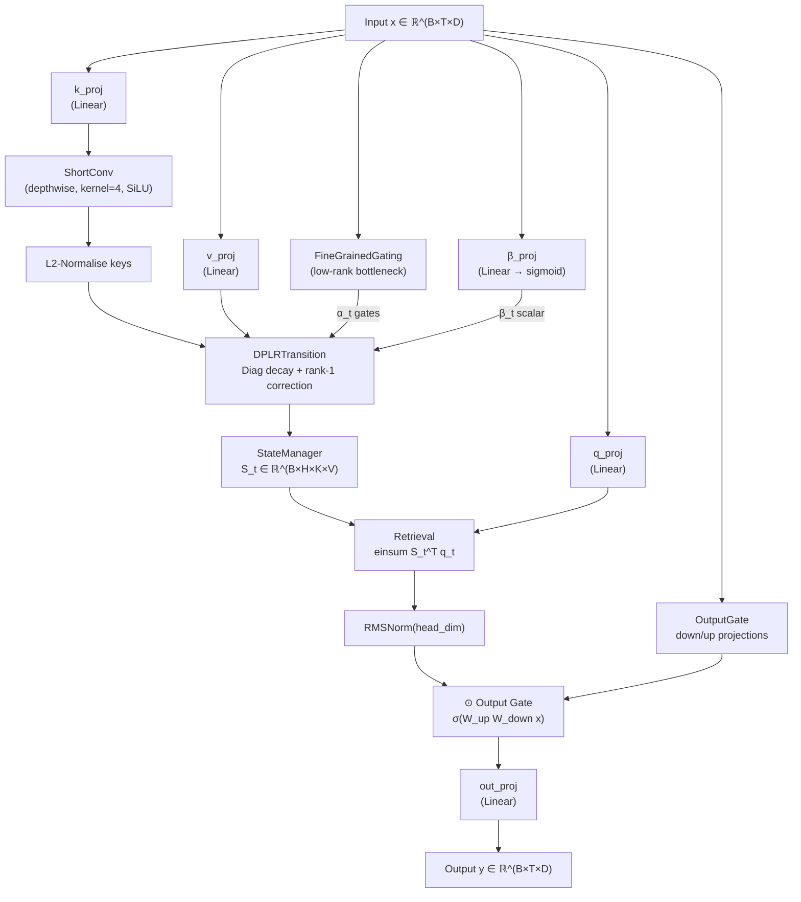
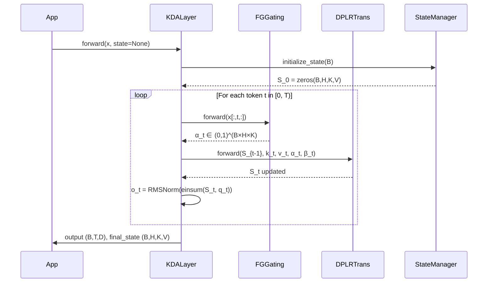
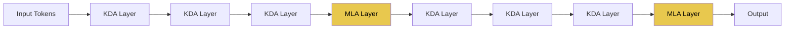
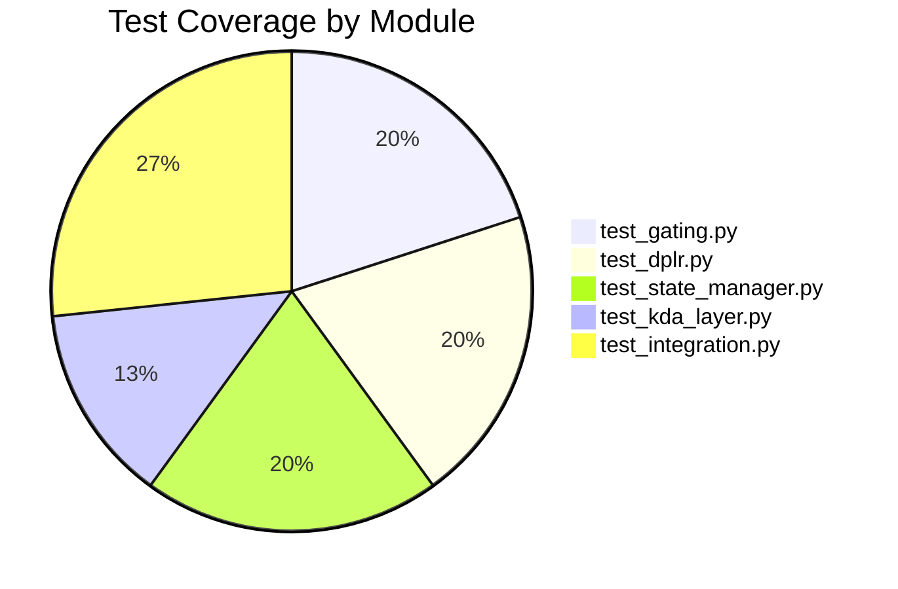
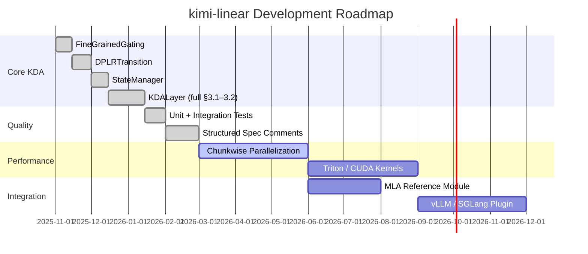
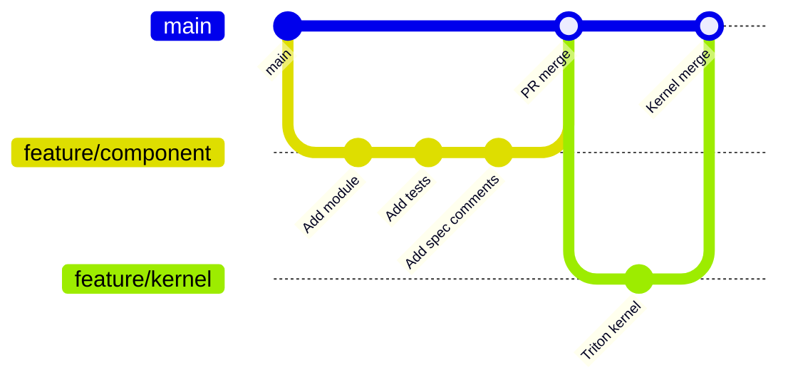

<div align="center" id="top">
  <h1>⚡ kimi-linear</h1>
  <p><em>Open-source implementation of Kimi Delta Attention — the hybrid linear-attention architecture from arXiv:2510.26692.</em></p>
</div>

<div align="center">

[](LICENSE)
[](https://github.com/hkevin01/kimi-linear/stargazers)
[](https://github.com/hkevin01/kimi-linear/network)
[](https://github.com/hkevin01/kimi-linear/commits/main)
[](https://github.com/hkevin01/kimi-linear)
[](https://github.com/hkevin01/kimi-linear/issues)
[](https://python.org)
[](https://pytorch.org)
[](https://arxiv.org/abs/2510.26692)
[](tests/)
[](https://github.com/psf/black)

</div>

---

## Table of Contents

- [Overview](#overview)
- [Key Features](#key-features)
- [Architecture](#architecture)
  - [KDA State Update](#kda-state-update)
  - [Component Diagram](#component-diagram)
  - [Sequence Flow](#sequence-flow)
- [Technology Stack](#technology-stack)
- [Setup & Installation](#setup--installation)
- [Usage](#usage)
- [Core Capabilities](#core-capabilities)
- [Benchmarks](#benchmarks)
- [Project Roadmap](#project-roadmap)
- [Implementation Status](#implementation-status)
- [Development](#development)
- [Contributing](#contributing)
- [Citation](#citation)
- [License](#license)

---

## 🔭 Overview

**kimi-linear** implements **Kimi Delta Attention (KDA)** — the linear attention module at the heart of the Kimi Linear hybrid architecture described in [`arXiv:2510.26692`](https://arxiv.org/abs/2510.26692).

KDA extends Gated DeltaNet with **channel-wise (fine-grained) forget gating**, replacing head-level scalar gates with per-channel vector gates $\alpha_t \in (0,1)^{d_k}$. This gives the finite-state RNN memory finer control over what context to retain or discard at each token step — improving long-context task performance without increasing the asymptotic O(B·H·K·V) state footprint.

The hybrid deployment stacks **three KDA layers for every one full MLA (Multi-Head Latent Attention) layer** (3:1 ratio), achieving up to **6× decoding throughput** and **75% KV-cache reduction** at 1M-token contexts versus a full-attention baseline.

> [!IMPORTANT]
> This implementation targets the **KDA module only**. The full Kimi Linear model (including MLA, MoE feed-forward, and training infra) is not included. This is a research reference implementation, not a production serving stack.

<p align="right">(<a href="#top">back to top ↑</a>)</p>

---

## ✨ Key Features

| Icon | Feature | Description | Impact | Status |
|------|---------|-------------|--------|--------|
| 🎛️ | Fine-Grained Gating | Per-channel $\alpha_t \in (0,1)^{d_k}$ via low-rank linear bottleneck | Selective memory control | ✅ Stable |
| 🔄 | DPLR Transition | Two-step diagonal + rank-1 correction; O(K·V) not O(K²·V) | 2× faster than general DPLR | ✅ Stable |
| 🧠 | State Management | Constant-memory RNN state with checkpointing and NaN guards | O(1) per-token memory | ✅ Stable |
| 🔬 | Short Conv on K | Depthwise causal conv (kernel=4) on key projection (§3.1) | Local context in keys | ✅ Stable |
| 📐 | RMSNorm Output | Per-head RMSNorm on retrieved content before output gate | Numerical stability | ✅ Stable |
| 🚪 | Output Gate | Low-rank sigmoid gate $\sigma(W_\text{up}W_\text{down}x) \odot \text{norm}(o_t)$ (§3.2) | Expressiveness | ✅ Stable |
| 🔢 | Mixed Precision | FP32 / FP16 / BF16 via PyTorch dtype | Flexibility | ✅ Stable |
| 🧪 | Test Suite | 45 unit + integration tests across all components | Coverage | ✅ Stable |

**Performance from original paper (at 1M-token context):**

- KV cache reduced by up to **75%** vs full MLA baseline
- Decoding throughput up to **6× faster** than full attention
- Prefill speedup of **2.3–2.9×** at 512k–1M token range
- MMLU-Pro (4k) ≥ 51.0 competitiveness maintained

> [!TIP]
> For inference-heavy workloads, enable `use_short_conv=True` (default) and `use_output_gate=True` (default) for the best accuracy; disable them only when comparing against the minimal ablation baseline.

<p align="right">(<a href="#top">back to top ↑</a>)</p>

---

## 🏗️ Architecture

### KDA State Update

At each token position $t$, the state $S_t \in \mathbb{R}^{d_k \times d_v}$ is updated as:

$$S_t = \bigl(\text{Diag}(\alpha_t) - \beta_t k_t k_t^\top \text{Diag}(\alpha_t)\bigr) S_{t-1} + \beta_t k_t v_t^\top$$

Computed in two sequential steps (no materialised K×K matrix):

1. **Diagonal decay** — $S' = \text{Diag}(\alpha_t) \cdot S_{t-1}$ (element-wise broadcast)
2. **Rank-1 delta correction** — $S_t = S' - \beta_t k_t (k_t^\top S')$ (two einsum calls)
3. **KV write** — $S_t \mathrel{+}= \beta_t k_t v_t^\top$

### Component Diagram


```mermaid
flowchart TD
    X["Input x ∈ ℝ^(B×T×D)"] --> QP["q_proj\n(Linear)"]
    X --> KP["k_proj\n(Linear)"]
    X --> VP["v_proj\n(Linear)"]
    X --> BP["β_proj\n(Linear → sigmoid)"]
    X --> FG["FineGrainedGating\n(low-rank bottleneck)"]
    X --> OG["OutputGate\ndown/up projections"]

    KP --> SC["ShortConv\n(depthwise, kernel=4, SiLU)"]
    SC --> KN["L2-Normalise keys"]

    KN --> DPLR["DPLRTransition\nDiag decay + rank-1 correction"]
    VP --> DPLR
    FG -- "α_t gates" --> DPLR
    BP -- "β_t scalar" --> DPLR

    DPLR --> SM["StateManager\nS_t ∈ ℝ^(B×H×K×V)"]
    SM --> RET["Retrieval\neinsum S_t^T q_t"]
    QP --> RET

    RET --> NORM["RMSNorm(head_dim)"]
    NORM --> MUL["⊙ Output Gate\nσ(W_up W_down x)"]
    OG --> MUL
    MUL --> OP["out_proj\n(Linear)"]
    OP --> Y["Output y ∈ ℝ^(B×T×D)"]
```

### Sequence Flow


```mermaid
sequenceDiagram
    participant App
    participant KDALayer
    participant FGGating
    participant DPLRTrans
    participant StateManager

    App->>KDALayer: forward(x, state=None)
    KDALayer->>StateManager: initialize_state(B)
    StateManager-->>KDALayer: S_0 = zeros(B,H,K,V)

    loop For each token t in [0, T)
        KDALayer->>FGGating: forward(x[:,t,:])
        FGGating-->>KDALayer: α_t ∈ (0,1)^(B×H×K)
        KDALayer->>DPLRTrans: forward(S_{t-1}, k_t, v_t, α_t, β_t)
        DPLRTrans-->>KDALayer: S_t updated
        KDALayer->>KDALayer: o_t = RMSNorm(einsum(S_t, q_t))
    end

    KDALayer->>App: output (B,T,D), final_state (B,H,K,V)
```

### Layer Stack (3:1 Hybrid Deployment)


```mermaid
flowchart LR
    I[Input Tokens] --> L1[KDA Layer]
    L1 --> L2[KDA Layer]
    L2 --> L3[KDA Layer]
    L3 --> L4[MLA Layer]
    L4 --> L5[KDA Layer]
    L5 --> L6[KDA Layer]
    L6 --> L7[KDA Layer]
    L7 --> L8[MLA Layer]
    L8 --> O[Output]
    style L4 fill:#e8c84e,color:#000
    style L8 fill:#e8c84e,color:#000
```

### Component Responsibilities

| Component | File | Purpose | Time | Space |
|-----------|------|---------|------|-------|
| `FineGrainedGating` | `src/kda/gating.py` | Per-channel α_t via W_down/W_up + sigmoid | O(B·T·D·rank) | O(D·rank) |
| `DPLRTransition` | `src/kda/dplr.py` | Two-step state transition; Gershgorin stability check | O(B·H·K·V) | O(B·H·K·V) |
| `StateManager` | `src/kda/state_manager.py` | S_t lifecycle: init, update, checkpoint, OOM guard | O(B·H·K·V) | O(B·H·K·V) |
| `KDALayer` | `src/kda/kda_layer.py` | Full KDA forward: projections → conv → gate → DPLR → norm → gate → out | O(B·T·H·K·V) | O(B·H·K·V) |

<p align="right">(<a href="#top">back to top ↑</a>)</p>

---

## 🧰 Technology Stack

| Technology | Purpose | Why Chosen | Alternatives Considered |
|------------|---------|------------|------------------------|
| Python 3.10+ | Implementation language | Pattern matching, type union syntax, widespread adoption | — |
| PyTorch 2.6+ | Tensor ops, autograd, nn.Module | Native `nn.RMSNorm`, `einsum` JIT, CUDA integration | JAX, MLX |
| `torch.einsum` | DPLR contractions | Readable, JIT-compilable, maps to cuBLAS | explicit matmul |
| `nn.RMSNorm` | Output normalisation | Native in PyTorch 2.4+; no mean shift bias | LayerNorm |
| `nn.Conv1d` (depthwise) | Short causal conv on K | Trivially causal via trim; grouped=inner_dim | custom CUDA conv |
| Black | Code formatting | Zero-config deterministic formatting | autopep8, ruff |
| pytest 9.x | Test runner | Rich fixtures, parameterize, --tb=short | unittest |
| Docker | Dev/prod environments | Reproducible CUDA environment | conda, venv-only |

<p align="right">(<a href="#top">back to top ↑</a>)</p>

---

## ⚙️ Setup & Installation

### Prerequisites

- Python ≥ 3.10
- PyTorch ≥ 2.6 (CPU or CUDA)
- CUDA ≥ 12.0 for GPU acceleration (optional)

### From source

```bash
git clone https://github.com/hkevin01/kimi-linear.git
cd kimi-linear
python -m venv .venv
source .venv/bin/activate
pip install -e ".[dev]"
```

### Dependencies only

```bash
pip install -r requirements.txt
```

### Docker

```bash
# Development (mounts source, hot-reload)
docker build -f docker/Dockerfile.dev -t kimi-linear:dev .
docker run --gpus all -it -v $(pwd):/workspace kimi-linear:dev

# Production
docker build -f docker/Dockerfile -t kimi-linear:latest .
```

### Verify installation

```bash
python -c "from src.kda import KDALayer; print('KDALayer OK')"
pytest tests/ -q
# 45 passed in ~1.2s
```

> [!NOTE]
> The `.venv` virtualenv is in `.gitignore`. Always activate it before running scripts or tests.

<p align="right">(<a href="#top">back to top ↑</a>)</p>

---

## 🚀 Usage

### Single KDA layer

```python
import torch
from src.kda import KDALayer

layer = KDALayer(
    hidden_dim=512,
    num_heads=8,
    head_dim=64,
    dropout=0.0,
    max_batch_size=32,
)

x = torch.randn(4, 128, 512)        # (batch, seq_len, hidden_dim)
output, state = layer(x)
print(output.shape)                  # torch.Size([4, 128, 512])
print(state.shape)                   # torch.Size([4, 8, 64, 64])
```

### Stateful chunked inference

```python
# Process long sequence in chunks — state carries context across boundaries
state = None
for chunk in chunks:                 # each chunk: (B, chunk_len, D)
    output, state = layer(chunk, state=state)
```

### Use individual components

```python
from src.kda import FineGrainedGating, StateManager, DPLRTransition

gating = FineGrainedGating(hidden_dim=512, num_heads=8, head_dim=64)
state_mgr = StateManager(key_dim=64, value_dim=64, num_heads=8, max_batch_size=32)
dplr = DPLRTransition(key_dim=64, value_dim=64, num_heads=8)

x = torch.randn(4, 128, 512)
gates, _ = gating(x)                 # (4, 128, 8, 64)

state = state_mgr.initialize_state(batch_size=4)  # (4, 8, 64, 64)
```

### Disable architectural options (ablation)

```python
# Without short conv (for sequential-chunk exact equivalence testing)
layer_no_conv = KDALayer(hidden_dim=512, num_heads=8, head_dim=64,
                         use_short_conv=False)

# Without output gate (minimal KDA baseline)
layer_minimal = KDALayer(hidden_dim=512, num_heads=8, head_dim=64,
                         use_short_conv=False, use_output_gate=False)
```

<p align="right">(<a href="#top">back to top ↑</a>)</p>

---

## 🔬 Core Capabilities

### 🎛️ Fine-Grained Channel-Wise Gating

Traditional linear attention uses a scalar gate per head. KDA uses a **K-dimensional vector gate** per head, computed via a low-rank bottleneck:

$$\alpha_t = \sigma\!\left(W_\text{up}\, \text{SiLU}(W_\text{down}\, x_t)\right) \quad \in (0,1)^{d_k}$$

This gives the model fine-grained control over which memory dimensions to retain or decay at each step — comparable expressiveness to full attention's content-adaptive routing at O(1) state cost.

### 🔄 Constrained DPLR Transition

The general DPLR update requires O(K²·V) operations. KDA exploits the structural constraint $a_t = \beta_t k_t$, $b_t = k_t \odot \alpha_t$ to reduce this to **O(K·V)**:

```
Step 1: S' = Diag(α_t) · S_{t-1}          ← element-wise broadcast
Step 2: S  = S' - β_t · k_t · (k_t⊤ S')  ← two einsum calls
Step 3: S  = S  + β_t · k_t · v_t⊤        ← outer product write
```

A Gershgorin spectral radius estimate is computed each forward pass to warn when the transition matrix approaches instability ($\rho > 1.1$).

### 📡 Short Convolution on Keys (§3.1)

A depthwise causal convolution (kernel size 4) is applied to the key projection before L2-normalisation:

```python
# Causal: pad left by kernel-1, then trim right side
K = self.k_conv(K.transpose(1, 2)).narrow(2, 0, T).transpose(1, 2)
K = F.silu(K)
```

This injects local positional context into keys without breaking the recurrent complexity.

> [!WARNING]
> Short conv requires cross-chunk key history for exact chunk-boundary equivalence. When testing sequential chunking, use `use_short_conv=False` to verify state-carry correctness independently.

### 📐 RMSNorm + Output Gate (§3.2)

After retrieval $o_t = S_t^\top q_t$, the output is normalised and gated:

$$y_t = \sigma\!\left(W_\text{up}\, W_\text{down}\, x_t\right) \odot \text{RMSNorm}(o_t)$$

The RMSNorm prevents magnitude explosion across deep stacks, while the output gate adds expressiveness without extra state cost.

<p align="right">(<a href="#top">back to top ↑</a>)</p>

---

## 📊 Benchmarks

Run the benchmark suite:

```bash
python scripts/benchmark/run_benchmarks.py
```

The benchmark script measures:
- **FineGrainedGating** — throughput across sequence lengths and batch sizes
- **DPLRTransition** — two-step state update latency per head configuration
- **KDALayer** — end-to-end forward pass latency across hidden dims

```bash
# Run tests with coverage
pytest --cov=src tests/ -v

# Run only integration tests
pytest tests/kda/test_integration.py -v
```

**Test distribution:**


```mermaid
pie title Test Coverage by Module
    "test_gating.py" : 9
    "test_dplr.py" : 9
    "test_state_manager.py" : 9
    "test_kda_layer.py" : 6
    "test_integration.py" : 12
```

<p align="right">(<a href="#top">back to top ↑</a>)</p>

---

## 🗺️ Project Roadmap


```mermaid
gantt
    title kimi-linear Development Roadmap
    dateFormat  YYYY-MM-DD
    section Core KDA
        FineGrainedGating         :done,    g1, 2025-11-01, 2025-11-15
        DPLRTransition            :done,    g2, 2025-11-15, 2025-12-01
        StateManager              :done,    g3, 2025-12-01, 2025-12-15
        KDALayer (full §3.1–3.2)  :done,    g4, 2025-12-15, 2026-01-15
    section Quality
        Unit + Integration Tests  :done,    q1, 2026-01-15, 2026-02-01
        Structured Spec Comments  :done,    q2, 2026-02-01, 2026-03-01
    section Performance
        Chunkwise Parallelization :active,  p1, 2026-03-01, 2026-06-01
        Triton / CUDA Kernels     :         p2, 2026-06-01, 2026-09-01
    section Integration
        MLA Reference Module      :         i1, 2026-06-01, 2026-08-01
        vLLM / SGLang Plugin      :         i2, 2026-09-01, 2026-12-01
```

| Phase | Goals | Target | Status |
|-------|-------|--------|--------|
| 1 — Core KDA | Gating, DPLR, State, Layer assembly | Q4 2025 | ✅ Complete |
| 2 — Quality | 45 tests, structured spec comments, Docker | Q1 2026 | ✅ Complete |
| 3 — Performance | Chunkwise parallel, WY rep, UT transform | Q2 2026 | 🟡 In Progress |
| 4 — Kernels | Triton DPLR kernel, fused gate projection | Q3 2026 | ⭕ Planned |
| 5 — Full Hybrid | MLA layer, 3:1 stack, vLLM integration | Q4 2026 | ⭕ Planned |

<p align="right">(<a href="#top">back to top ↑</a>)</p>

---

## 📋 Implementation Status

| Component | Version | Stability | Tests | Known Limitations |
|-----------|---------|-----------|-------|-------------------|
| `FineGrainedGating` | 1.0 | ✅ Stable | 9 | — |
| `DPLRTransition` | 1.0 | ✅ Stable | 9 | Eigen check is Gershgorin heuristic |
| `StateManager` | 1.0 | ✅ Stable | 9 | Pre-alloc buffer requires max_batch_size at init |
| `KDALayer` | 1.1 | ✅ Stable | 6 + 12 integration | Short conv needs chunk-carry for exact equivalence |
| Chunkwise parallel | — | ⭕ Planned | — | — |
| WY representation | — | ⭕ Planned | — | — |
| UT transform | — | ⭕ Planned | — | — |
| MLA integration | — | ⭕ Planned | — | — |
| Triton/CUDA kernels | — | ⭕ Planned | — | — |
| vLLM integration | — | ⭕ Planned | — | — |

<p align="right">(<a href="#top">back to top ↑</a>)</p>

---

## 🛠️ Development

### Project Structure

```
kimi-linear/
├── src/
│   └── kda/
│       ├── __init__.py          # Package exports
│       ├── gating.py            # FineGrainedGating (KDA-GATE-*)
│       ├── dplr.py              # DPLRTransition   (KDA-DPLR-*)
│       ├── state_manager.py     # StateManager     (KDA-SM-*)
│       └── kda_layer.py         # KDALayer         (KDA-LAYER-*)
├── tests/
│   └── kda/
│       ├── test_gating.py
│       ├── test_dplr.py
│       ├── test_state_manager.py
│       ├── test_kda_layer.py
│       └── test_integration.py  # End-to-end integration tests
├── scripts/
│   └── benchmark/
│       └── run_benchmarks.py
├── docs/
│   ├── project-plan.md
│   ├── PROJECT_STATUS.md
│   └── IMPLEMENTATION_SUMMARY.md
├── docker/
│   ├── Dockerfile
│   └── Dockerfile.dev
├── requirements.txt
├── setup.py
└── README.md
```

### Code Style

```bash
black src/ tests/     # format
pylint src/           # lint
mypy src/             # type-check
```

### Adding a New Component

1. Create module in `src/kda/`
2. Add structured spec comment block (IDs: `KDA-<MODULE>-<TYPE>-<NNN>`)
3. Write unit tests in `tests/kda/test_<module>.py`
4. Export from `src/kda/__init__.py`
5. Add integration coverage in `tests/kda/test_integration.py`

<details>
<summary>📐 Spec Comment Format</summary>

Every module, class, and public method carries a structured spec block:

```python
# ─────────────────────────────────────────────────────────────────────────────
# METHOD SPEC
# ID:            KDA-MODULE-FWD-001
# Requirement:   One precise, testable statement of what this method must do.
# Purpose:       Why this method exists and what objective it supports.
# Rationale:     Engineering reasoning behind the design choice.
# Inputs:        All arguments: name, type, units, valid ranges.
# Outputs:       Return values: type, shape, constraints.
# Preconditions: What must be true before calling.
# Postconditions:What is guaranteed true after return.
# Side Effects:  State changes, I/O, counters updated.
# Failure Modes: How the method fails and mitigation strategy.
# Verification:  Which tests cover this method.
# References:    Paper sections, standards, or algorithms implemented.
# ─────────────────────────────────────────────────────────────────────────────
```

</details>

<details>
<summary>🔁 Git Workflow</summary>


```mermaid
gitGraph
    commit id: "main"
    branch feature/component
    checkout feature/component
    commit id: "Add module"
    commit id: "Add tests"
    commit id: "Add spec comments"
    checkout main
    merge feature/component id: "PR merge"
    branch feature/kernel
    checkout feature/kernel
    commit id: "Triton kernel"
    checkout main
    merge feature/kernel id: "Kernel merge"
```

Branch naming: `feature/<component>`, `fix/<issue>`, `perf/<scope>`.

</details>

<p align="right">(<a href="#top">back to top ↑</a>)</p>

---

## 🤝 Contributing

Contributions are welcome. Please open an issue before starting significant work.

<details>
<summary>📋 Contribution Guidelines</summary>

### Workflow

1. Fork the repository
2. Create a branch: `git checkout -b feature/your-feature`
3. Make changes with tests: `pytest tests/ -q`
4. Format: `black src/ tests/`
5. Open a pull request against `main`

### Requirements for merge

- All 45 existing tests must pass
- New public methods must have a structured spec comment block
- New components require unit tests + at least one integration test
- No raw `print()` — use `logging` throughout
- Docstrings not required for private helpers; required for public API

### Code conventions

- `self._attr` prefix for instrumentation counters (`_fwd_calls`, `_fwd_time_ms`)
- `@property` shims for any renamed attributes to preserve backward compatibility
- `torch.einsum` preferred over explicit `matmul` for readability at contraction boundaries

</details>

<p align="right">(<a href="#top">back to top ↑</a>)</p>

---

## 📎 Citation

If this implementation is useful in your work, please cite the original paper:

```bibtex
@article{kimiteam2025kimilinear,
  title   = {Kimi Linear: An Expressive, Efficient Attention Architecture},
  author  = {Kimi Team},
  journal = {arXiv preprint arXiv:2510.26692},
  year    = {2025}
}
```

---

## 📄 License

This project is licensed under the **MIT License** — you are free to use, modify, and distribute it with attribution. See [LICENSE](LICENSE) for the full text.

The Kimi Linear architecture is described in [arXiv:2510.26692](https://arxiv.org/abs/2510.26692) by the Kimi Team.

<p align="right">(<a href="#top">back to top ↑</a>)</p>
